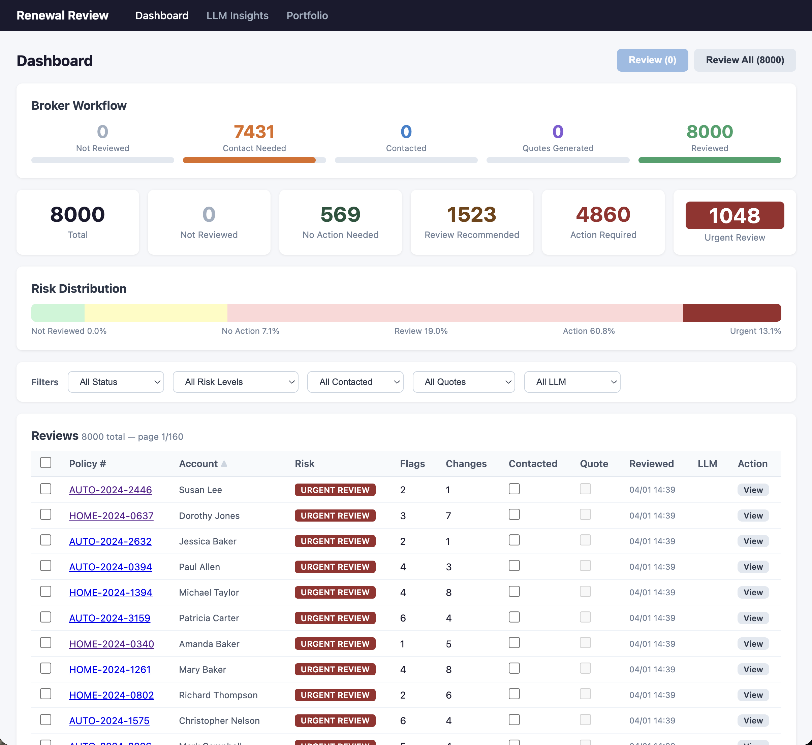
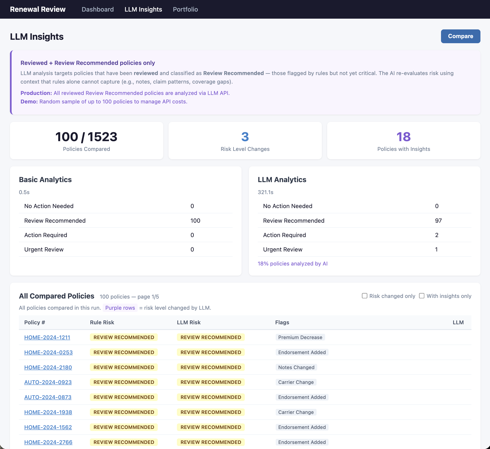
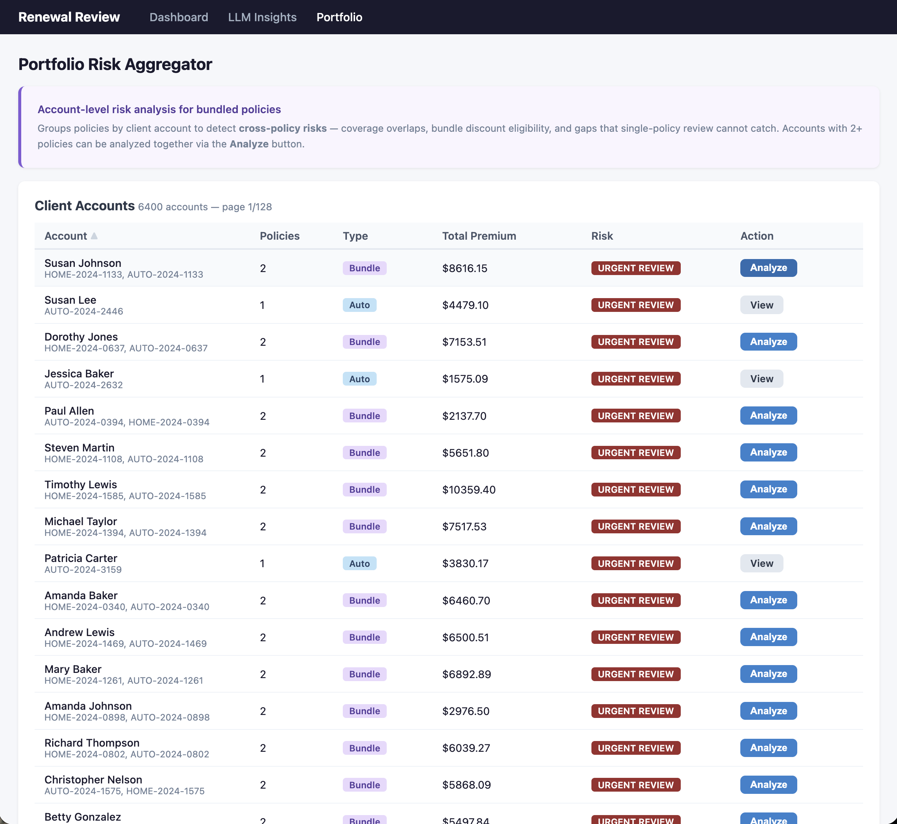
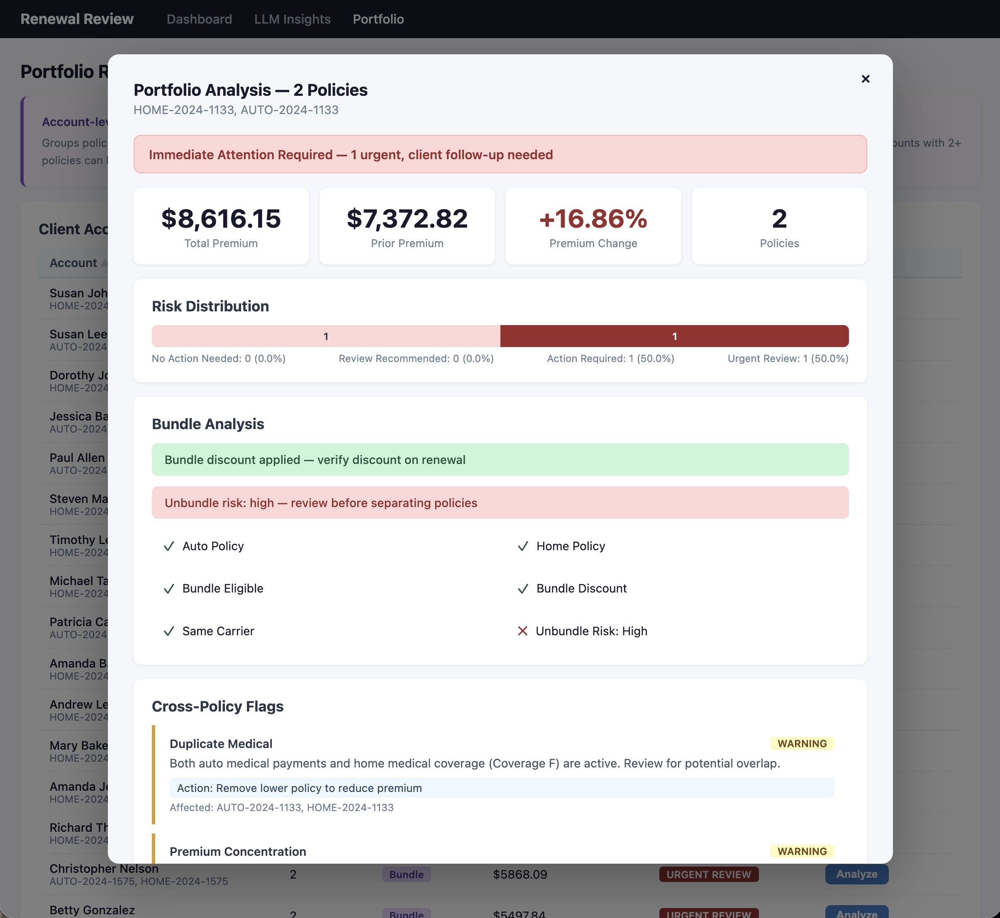
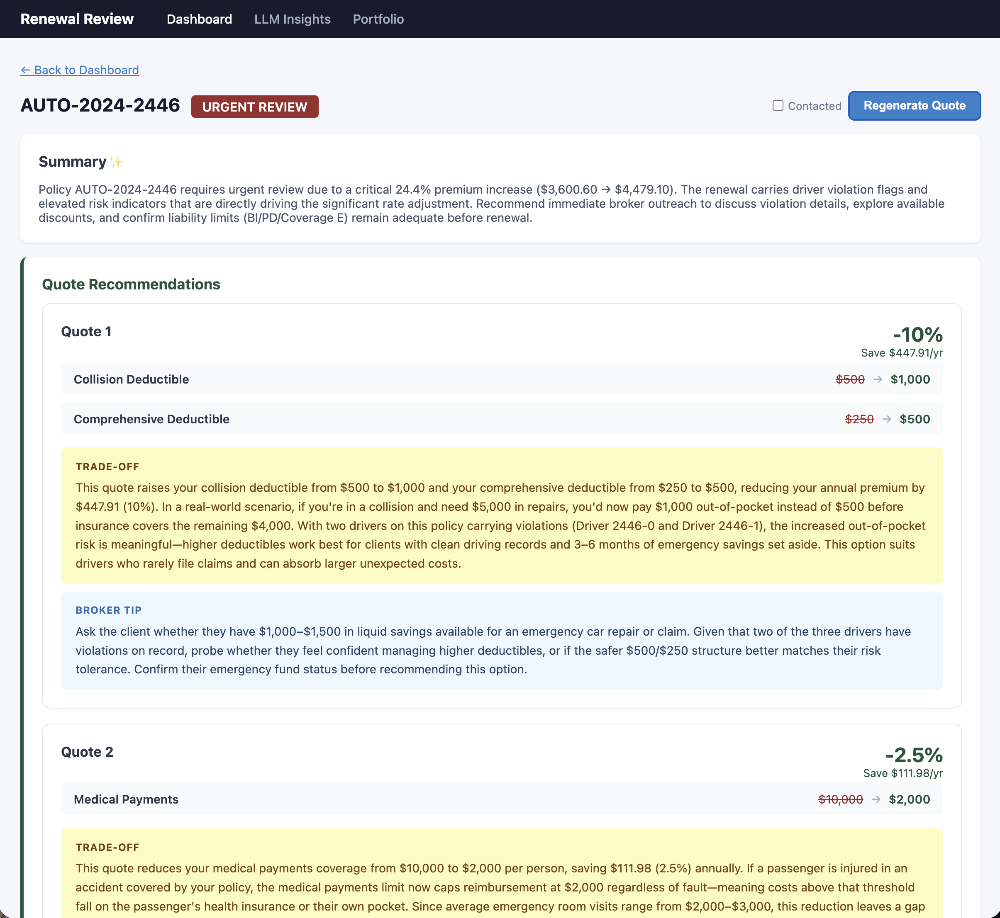

# Renewal Review

Insurance renewal review pipeline - rule-based + LLM hybrid analysis for personal lines (Auto + Home).

Compares prior vs. renewal policy data, flags risk changes, generates broker-ready summaries and alternative quotes.

<br/>

## Screenshots

### Dashboard
Broker workflow tracker, risk distribution, and policy review table with filtering.



### LLM Insights
Side-by-side comparison of rule-based vs. LLM risk analysis with per-policy breakdown.



### Portfolio Risk Aggregator
Account-level view grouping bundled policies to detect cross-policy risks.



### Portfolio Analysis
Bundle analysis, cross-policy flags, and premium concentration warnings.



### Quote Recommendations
LLM-generated alternative quotes with trade-off explanations and broker tips.



<br/>

## Tech Stack

- **Backend**: FastAPI + Uvicorn
- **LLM**: Anthropic Claude (Sonnet / Haiku) via Langfuse
- **DB**: PostgreSQL (optional, write-through cache)
- **Frontend**: Jinja2 templates (server-rendered)
- **Tooling**: uv, Ruff, pytest, Docker Compose

<br/>

## Quick Start

### Prerequisites

- Python 3.13+
- [uv](https://docs.astral.sh/uv/) package manager
- PostgreSQL 16+ (optional - app works without DB, data stays in-memory)

### 1. Setup

```bash
git clone https://github.com/ella-yschoi/renewal-review.git && cd renewal-review

# Install dependencies
uv sync --dev

# Create .env from example
cp .env.example .env
```

### 2. Generate Sample Data

```bash
uv run python data/generate.py

# Seed PostgreSQL (requires RR_DB_URL in .env)
uv run python scripts/seed_db.py
```

### 3. Run (without DB)

```bash
make dev
# or
uv run uvicorn app.main:app --host 0.0.0.0 --port 8000 --reload
```

Open http://localhost:8000

### 4. Run with Docker (includes PostgreSQL)

```bash
make compose-up
# Stop: make compose-down
```

<br/>

## LLM Configuration

Set `RR_LLM_ENABLED=true` in `.env` and add your Anthropic API key:

```
RR_LLM_ENABLED=true
ANTHROPIC_API_KEY=sk-ant-...
```

Without LLM enabled, the app uses mock responses for development.

<br/>

## Development

```bash
# Run tests
make test

# Run linter
make lint
```

<br/>

## Project Structure

```
app/
  api/          # FastAPI routers
  application/  # Use cases (batch processing, LLM analysis)
  domain/       # Models, services, ports (business logic)
  adaptor/      # LLM clients, DB persistence, storage
  infra/        # DB engine, dependency injection
  templates/    # Jinja2 HTML templates
data/           # Sample renewal data + generator
tests/          # pytest test suite
docs/           # Design doc, presentation slides
```
