<div class="pt-3 text-white text-5xl">
Agent-Native Engineering
</div>

<div class="pt-5 text-gray-400 text-2xl">
Compress a work week into one day
</div>

<div class="pt-15 text-medium text-gray-400 max-w-xl mx-auto">
Ella Choi · Feb 2026

</div>

<!--

#### Small talk

Hi Heather, thank you so much for taking the time today.
Chloe is actually in the meeting room inside the condo right now.

#### Introduction

Hi, I'm Ella.
I’ve been in the tech industry for 5 years,
with 4 years in customer support and 1 year in software engineering.

And I'm not afraid to ride the AI wave.

(개인적으로 말하듯이!)
I was genuinely['제'뉴언리] excited when I received this assignment.
My previous company didn't allow us to use AI, so I'd been exploring it on my own.
Being able to have this deep conversation about AI with an AI-first company like Quandri means a lot to me.

I gave this assignment everything I had, and I truly appreciate your time today. (발표 하라고 하면 타이틀 말하기)

#### Title

The title of this presentation is "Agent-Native Engineering."
-->

---
glowSeed: 2
---

# What I Did

<div class="text-lg text-gray-400 mb-8">
A pipeline that automatically reviews insurance renewal policies
</div>

<div class="space-y-4 max-w-2xl mx-auto text-left">
<v-click>
<div class="flex items-start gap-3">
  <div class="text-blue-400 font-bold text-xl mt-0.5">1.</div>
  <div><span class="text-white font-bold">Agent-Native Environment</span><br/><span class="text-gray-400">Set up, plan thoroughly, then let AI execute</span></div>
</div>
</v-click>
<v-click>
<div class="flex items-start gap-3">
  <div class="text-blue-400 font-bold text-xl mt-0.5">2.</div>
  <div><span class="text-white font-bold">5 Experiments</span><br/><span class="text-gray-400">Which AI workflows are most effective?</span></div>
</div>
</v-click>
<v-click>
<div class="flex items-start gap-3">
  <div class="text-blue-400 font-bold text-xl mt-0.5">3.</div>
  <div><span class="text-white font-bold">Package & Share</span><br/><span class="text-gray-400">Reusable Skills and guides for the team</span></div>
</div>
</v-click>
</div>

<!--
In one sentence, I built a pipeline, that automatically reviews, insurance renewal policies.
I set three goals for this project:
(👉넘겨)

1) Set up an agent-native environment(👉넘겨)
2) 5 Experiments with which AI workflows are most effective(👉넘겨)
3) Package the results into reusable Skills and guides for the team

In this presentation, I'll share what I built, how fast it was, and the results of five experiments.
-->

---
layout: center
class: text-center
glowSeed: 7
---

# The Problem

<div class="text-lg text-gray-400 mb-6">
Brokers review each policy manually
</div>

<div class="grid grid-cols-3 gap-6 max-w-2xl mx-auto">
<v-click>
<div class="border border-red-500/30 bg-red-950/20 rounded-lg p-5 text-center">
  <div class="text-4xl font-bold text-red-400">20min+</div>
  <div class="text-sm text-gray-400 pt-1">manual comparison</div>
</div>
</v-click>
<v-click>
<div class="border border-red-500/30 bg-red-950/20 rounded-lg p-5 text-center">
  <div class="text-4xl font-bold text-red-400">15+</div>
  <div class="text-sm text-gray-400 pt-1">risk categories</div>
</div>
</v-click>
<v-click>
<div class="border border-red-500/30 bg-red-950/20 rounded-lg p-5 text-center">
  <div class="text-4xl font-bold text-red-400">Missed</div>
  <div class="text-sm text-gray-400 pt-1">text-based signals</div>
</div>
</v-click>
</div>

<v-click>
<div class="pt-8 text-3xl text-gray-300">

**Setup** → **Plan** → **Build** → **Experiment** → **Iterate**

</div>
</v-click>

<!--
According to Quandri's blog post "A day in the life: With vs.[벌스스] without Quandri,"
brokers review each policy one by one, (👉넘겨) averaging 20 minutes per policy.

They have to visually check (👉넘겨) over 15 risk categories, and hidden risk signals in memo or endorsement text (👉넘겨) are easy to miss.

I built a product to solve this problem.
The development approach (👉넘겨) was Setup → Plan → Build → Experiment → Iterate.

#### What Setup means here:

It's about setting up the environment first so AI agents can work effectively. Things like CLAUDE.md[dot MD], convention.md[dot MD] for code rules, and Git Hooks that automatically enforce quality gates.

I'll walk you through this flow in the presentation.
-->

---
glowSeed: 20
---

# What I Built

<div class="grid grid-cols-2 gap-5 mt-6">
<v-click>
<div class="border border-green-500/30 bg-green-950/20 rounded-lg p-6">
  <div class="text-green-400 font-bold mb-5 text-2xl">Features</div>
  <div class="space-y-2 text-sm">
    <div>📊 Dashboard - broker workflow tracking, reviews table</div>
    <div>🔎 Review Detail - diff, flags, inline quote generation</div>
    <div>🤖 LLM Insights - Review Recommended 100 sample</div>
    <div>📦 Portfolio Risk Aggregator - bundles, duplicates</div>
  </div>
</div>
</v-click>
<v-click>
<div class="border border-cyan-500/30 bg-cyan-950/20 rounded-lg p-6">
  <div class="text-cyan-400 font-bold mb-1 text-2xl">Processing Pipeline</div>
  <div class="text-xs text-gray-500 mb-4">Out of scope: data ingestion from BMS - raw data pre-loaded in PostgreSQL</div>
  <div class="space-y-1.5 text-sm">
    <div>📥 8,000 Policies <span class="text-gray-500">(PostgreSQL)</span></div>
    <div class="text-gray-600 pl-6 text-xs">↓</div>
    <div>⚙️ Parser · ACORD normalization</div>
    <div class="text-gray-600 pl-6 text-xs">↓</div>
    <div>🔍 Diff Engine · Prior vs Renewal</div>
    <div class="text-gray-600 pl-6 text-xs">↓</div>
    <div>🚩 Rule Flagger · 23 rules → DiffFlags</div>
    <div class="text-gray-600 pl-6 text-xs">↓</div>
    <div>⚠️ Risk Classifier · 4 levels</div>
    <div class="text-gray-600 pl-6 text-xs">↓</div>
    <div class="text-yellow-400">📝 Keywords → Rule · Meaning → LLM</div>
  </div>
</div>
</v-click>
</div>

<!--
#### Here's the product I built to solve this problem.(👉넘겨)

I built four main features: Dashboard, Review Detail, LLM Insights, and Portfolio Risk Aggregator['애'구리게이더]. I'll show you the actual UI in a live demo after the presentation.(👉넘겨)

(아래는 시간 상 스킵, 나중에 데모 때 설명)
- Dashboard: batch result summary, risk distribution, broker workflow (contact/quote) tracking
- Review Detail: per-policy change details and flags, inline quote generation
- LLM Insights: 100-sample from Review Recommended, unstructured text analysis
- Portfolio Risk Aggregator: same-customer Auto+Home bundle management, coverage overlap/gap detection

#### Let me walk through the processing pipeline.

- For context, I start with 8,000 insurance policy records already loaded in PostgreSQL's raw data table.
- First, the Parser normalizes data to ACORD standards. In a real scenario the volume would be higher, but for this project I capped it at 8,000.
- Then the Diff Engine compares prior and renewal policies field by field, 
- and the Rule Flagger applies 23 rules to flag changes, like premium spikes, coverage reductions, and deductible changes. (보험 갱신 리뷰에서 체크해야 할 리스크 시그널을 ACORD 표준 기반으로 분류한 결과 23개가 나온 것입니다.)
- Next, The Risk Classifier combines these flags into four risk levels: No Action, Review Recommended, Action Required, and Urgent Review, then presents them to the broker.
- LLM is only applied for unstructured text interpretation and multi-context synthesis. Deterministic[디털미니스틱] decisions on structured inputs stay rule-based.
-->

---
layout: center
glowSeed: 3
---

# The Speed Story

<div class="mt-6 grid grid-cols-[1fr_auto_1fr] gap-6 items-center max-w-2xl mx-auto">
<v-click>
<div class="border border-red-500/30 bg-red-950/20 rounded-lg p-6 text-center">
  <div class="text-5xl font-bold text-gray-500">11 days</div>
  <div class="text-sm text-gray-500 pt-2">Manual (~89h estimated)</div>
</div>
</v-click>
<div class="text-3xl text-gray-600">→</div>
<v-click>
<div class="border border-green-500/30 bg-green-950/20 rounded-lg p-6 text-center">
  <div class="text-5xl font-bold text-green-400">2 days</div>
  <div class="text-sm text-green-400/70 pt-2">With AI (core + 5 experiments)</div>
</div>
</v-click>
</div>

<v-click>
<div class="pt-4 max-w-xl mx-auto">

| Phase                        | AI     | Manual | Speedup |
| ---------------------------- | ------ | ------ | ------- |
| Domain Research + Design     | 40 min | 14h    | 21x     |
| Models + Parser + Rules      | 75 min | 14h    | 11x     |
| LLM Integration + Mock Data  | 50 min | 12h    | 14x     |
| API + Frontend + DB          | 90 min | 24h    | 16x     |
| Tests + Refactor + Infra     | 75 min | 25h    | 20x     |

</div>
</v-click>

<!--
Estimated['에'스티메이티드] for a senior developer, (👉넘겨) this project would take about 89 hours of pure software development, roughly 11 business days.
That includes everything, from domain research to CI/CD.

With AI agents, (👉넘겨) I completed the core system plus 5 experiments in 2 days.(👉넘겨)

(개인적으로 말하듯이!)
Honestly, I knew nothing about insurance, but by planning with Claude and injecting ACORD standards via a Custom Skill, I could start modeling right away without any study.
-->

---
glowSeed: 10
---

# How: Agent-Native Setup

<div class="mt-6 grid grid-cols-2 gap-5">
<v-click>
<div class="border border-blue-500/30 bg-blue-950/20 rounded-lg p-4">
  <div class="text-blue-400 font-bold mb-2">Rulesets</div>

```yaml
# CLAUDE.md (every session)
- Read convention.md first
- Code style
- Minimal diffs, token-aware
- Pre-commit: Ruff + Gitleaks + Semgrep
```

```yaml
# convention.md
- Files < 300 lines
- Hexagonal (domain/ imports nothing)
- StrEnum, Config, Immutable models
```

</div>
</v-click>
<v-click>
<div class="border border-purple-500/30 bg-purple-950/20 rounded-lg p-4">
  <div class="text-purple-400 font-bold mb-2">Claude Code Hooks</div>
  <div class="space-y-1 text-sm">
    <div>🔒 require-experiment-log</div>
    <div>🔒 require-design-doc</div>
    <div>💡 remind-design-doc</div>
    <div>🧹 lint-on-save</div>
    <div>✅ verify-completion</div>
  </div>
</div>
</v-click>
</div>

<!--
The core of agent-native isn't handing[핸딩] code off to the agent. It's building an environment where the agent can work effectively first.(👉넘겨)

#### CLAUDE.md and convention.md

I defined behavior rules with CLAUDE.md and convention.md, and set quality gates (tests, linter, security scanner) as the agent's reward signal.
They run automatically on every commit, and if any gate fails, the commit is blocked.(👉넘겨)

#### Claude Code Hooks

I also created 5 Claude Code Hooks for this project.

To keep it brief, let me highlight just one. remind-design-doc hook reminds the agent to keep the design doc in sync with code changes.

These 5 hooks are included in .claude/hooks/[dot claude slash hooks], so they apply automatically on git clone.

(아래 각 훅 설명은 생략)
- require-design-doc.sh - blocks commits without design-doc when code changes
- require-experiment-log.sh - blocks commits without experiment logs on experiment branches
- lint-on-save.sh - auto-lints on file save
- remind-design-doc.sh - reminds to update design-doc after code changes
- verify-completion.sh - verifies completion when the agent stops
-->

---
glowSeed: 5
---

# Documentation-Driven Planning

<div class="mt-6 grid grid-cols-3 gap-4">
<v-click>
<div class="border border-cyan-500/30 bg-cyan-950/20 rounded-lg p-4 h-full">
  <div class="text-cyan-400 font-bold mb-2">requirements.md</div>
  <div class="space-y-1.5 text-sm">
    <div>User stories & functional specs</div>
    <div>Success criteria w/ numbers</div>
    <div>Non-functional requirements</div>
    <div>Scope boundaries</div>
  </div>
</div>
</v-click>
<v-click>
<div class="border border-green-500/30 bg-green-950/20 rounded-lg p-4 h-full">
  <div class="text-green-400 font-bold mb-2">design-doc.md</div>
  <div class="space-y-1.5 text-sm">
    <div>5-layer hexagonal arch</div>
    <div>27 Pydantic models (8 modules)</div>
    <div>23 DiffFlags, 4 risk levels</div>
    <div>20 API endpoints</div>
    <div class="text-yellow-400">Auto-updated via hooks</div>
  </div>
</div>
</v-click>
<v-click>
<div class="border border-purple-500/30 bg-purple-950/20 rounded-lg p-4 h-full">
  <div class="text-purple-400 font-bold mb-2">implementation-plan.md</div>
  <div class="space-y-1.5 text-sm">
    <div>Policy fields + risk thresholds</div>
    <div>Rule engine → LLM rules</div>
    <div>Coding conventions</div>
  </div>
</div>
</v-click>
</div>

<!--
I believed detailed planning was essential before writing any code. So I co-authored three documents with Claude Code.(👉넘겨)

#### requirements.md

After injecting insurance domain knowledge via a Custom Skill, I co-wrote the requirements document with the agent.

I clearly defined user stories, functional requirements, success criteria[크라이테리아] with non-functional requirements, and scope boundaries.

(말도 안된다는 느낌)
The key was giving the agent not 

"build me an insurance system" 

but specifically 

what to build and what not to build.(👉넘겨)

#### design-doc.md

This documents the architecture, data models, and API surface.
Even when requirements change, the hooks force automatic updates on code changes, so code and documentation stay in sync.(👉넘겨)

#### implementation-plan.md

This details data structures and thresholds[뜨레숄즈], rule engine and LLM analysis rules, and coding conventions. The specific rules and reference values the agent follows during implementation live[리브] here.(👉넘겨)
-->

---
layout: center
class: text-center
glowSeed: 22
---

# Five Experiments

<div class="text-lg text-gray-400 pb-6">
Each answered a specific question about AI-assisted development

```mermaid {scale: 0.85}
flowchart LR
    E1["<b>Exp 1</b><br/>SubAgent vs<br/>Agent Teams"] --> E2["<b>Exp 2</b><br/>Triangular<br/>Verification"]
    E2 --> E3["<b>Exp 3</b><br/>Agentic Dev<br/>Pipeline"]
    E3 --> E4["<b>Exp 4</b><br/>Pipeline<br/>Reusability"]
    E4 --> E5["<b>Exp 5</b><br/>Langfuse LLM<br/>Benchmark"]

    style E1 fill:#1e3a5f,stroke:#4a9eff
    style E2 fill:#1e3a5f,stroke:#4a9eff
    style E3 fill:#1e3a5f,stroke:#4a9eff
    style E4 fill:#1e3a5f,stroke:#4a9eff
    style E5 fill:#1e3a5f,stroke:#4a9eff
```

</div>



<v-clicks>

<div class="grid grid-cols-5 gap-6 pt-4 text-base text-gray-400">
<div class="text-center">Multiple agents?</div>
<div class="text-center">Can verify?</div>
<div class="text-center">Automate fix?</div>
<div class="text-center">Generalizes?</div>
<div class="text-center">Best LLM?</div>
</div>

</v-clicks>

<!--
I ran five experiments sequentially[싀퀀실리], with each building on the results of the previous one.(👉넘겨)

Here's a quick summary. I'll cover each experiment in detail starting from the next slide.

(시간 상 아래 내용은 생략)
- Experiment 1: Can multiple agents work in parallel?
- Experiment 2: Can agents verify each other's work?
- Experiment 3: Can we automate the implement-verify-fix cycle?
- Experiment 4: Does that pipeline generalize to other features and projects?
- Experiment 5: Which LLM provider is optimal for this domain?
-->

---
glowSeed: 18
---

# Exp 1: SubAgent vs Agent Teams

<div class="text-sm text-gray-400 mb-3">Same task (Analytics, ~300 lines) · Two orchestration patterns</div>

<div class="grid grid-cols-2 gap-4">
<v-click>
<div class="border border-blue-500/30 bg-blue-950/20 rounded-lg p-4">
  <div class="text-blue-400 font-bold mb-2">SubAgent Pattern</div>

```
Orchestrator
  ├─ [1] Research (Explore)
  ├─ [2] Model + Service ─┐ parallel
  ├─ [3] Routes + Main ───┘
  └─ [4] Tests (after 2,3)
```
</div>
</v-click>
<v-click>
<div class="border border-purple-500/30 bg-purple-950/20 rounded-lg p-4">
  <div class="text-purple-400 font-bold mb-2">Agent Teams Pattern</div>

```
Team Lead
  ├─ TaskCreate: #1 → #2 → #3
  ├─ [spawn] modeler → task #1
  ├─ [spawn] router  → task #2
  └─ [spawn] tester  → task #3
```
</div>
</v-click>
</div>

<v-click>
<div class="mt-4">

| Metric | SubAgent           | Agent Teams        |
| ------ | ------------------ | ------------------ |
| Time   | 354s (~6 min)      | 318s (~5 min)      |
| Code   | 334 lines, 8 files | 335 lines, 8 files |
| Tests  | 73 all pass        | 73 all pass        |

<div class="text-xl mt-4 text-gray-400"> SubAgent simpler. Agent Teams shines at scale with complex dependencies.</div>

</div>
</v-click>

<!--
I gave the same task to SubAgent and Agent Teams, implementing a feature using two different approaches.(👉넘겨)

SubAgent is a one-shot worker running inside the parent session. It has its own context window but only returns results to the main session.(👉넘겨)

Agent Teams run each teammate as a fully independent Claude Code session. They exchange messages and self-coordinate through a shared task list.(👉넘겨)

The results were nearly identical, and that's the[디] insight.

For small tasks like this, SubAgent is simpler with less overhead. Agent Teams would shine at larger scale[스케일] with complex dependencies.
-->

---
glowSeed: 12
---

# Exp 2: Triangular Verification - Concept

<div class="text-sm text-gray-400 mb-6">3-agent information isolation catches what linters cannot</div>

<div class="grid grid-cols-[1fr_auto_1fr] gap-4 items-center">
<div class="space-y-3">
<v-click>
<div class="border border-green-500/30 bg-green-950/20 rounded-lg p-4">
  <div class="text-green-400 font-bold">Agent A (Implementer)</div>
  <div class="text-sm pt-1">Reads: requirements + code</div>
  <div class="text-sm text-gray-400">Writes the feature</div>
</div>
</v-click>
<v-click>
<div class="border border-cyan-500/30 bg-cyan-950/20 rounded-lg p-4">
  <div class="text-cyan-400 font-bold">Agent B (Blind Review)</div>
  <div class="text-sm pt-1">Reads: code + convention</div>
  <div class="text-red-400 text-sm">Cannot see requirements</div>
</div>
</v-click>
<v-click>
<div class="border border-yellow-500/30 bg-yellow-950/20 rounded-lg p-4">
  <div class="text-yellow-400 font-bold">Agent C (Judge)</div>
  <div class="text-sm pt-1">Reads: requirements + B's review</div>
  <div class="text-red-400 text-sm">Cannot see code</div>
</div>
</v-click>
</div>
<div class="text-2xl text-gray-500">→</div>
<v-click>
<div>
  <div class="text-center text-xl font-bold pb-3">PASS / FAIL</div>

<table class="text-sm w-full">
  <thead><tr class="border-b border-gray-600"><th class="text-left py-1">Tool</th><th class="text-left py-1">Catches</th><th class="text-left py-1">Misses</th></tr></thead>
  <tbody>
    <tr class="text-blue-400"><td class="py-1">Ruff/Semgrep</td><td>Syntax, security</td><td>Intent</td></tr>
    <tr class="text-yellow-400"><td class="py-1">Pytest</td><td>Logic bugs</td><td>Missing feat</td></tr>
    <tr class="text-green-400 font-bold"><td class="py-1">Triangular</td><td>Intent, gaps</td><td>UI</td></tr>
  </tbody>
</table>
</div>
</v-click>
</div>

<!--
The second experiment was triangular verification.
The core idea is information isolation.(👉넘겨)

- Agent A is the Implementer. It reads the requirements and writes the code.(👉넘겨)
- Agent B sees only code and conventions, and describes "what this code does." It cannot see the requirements.(👉넘겨)
- Agent C sees only the requirements and B's description, and judges "is there a mismatch?" It cannot see the code.

When these three perspectives - requirements, code, and independent analysis - align, it's a PASS.(👉넘겨)

#### Traditional vs. Triangular
Traditional tools (ruff[러프], pytest, semgrep[셈그렙]) only checked syntax and security, but triangular verification additionally verifies "was it built as intended?", confirming whether the developer implemented the requirements correctly.

(고민해보면서 여기 생각은 해봤어)
#### Limitations
Currently, Agent B only reads backend code, so it can't verify UI. Short-term, we could extend Agent B's file scope to include frontend code. Mid-term, we could use screenshots + Vision LLM to compare the actual rendered UI against requirements.
-->

---
glowSeed: 7
---

# Exp 2: Why SubAgent, Not Agent Teams?

<div class="text-sm text-gray-400 mb-6">Information isolation requires prompt-level control</div>

<div class="grid grid-cols-2 gap-6">
<v-click>
<div class="border border-cyan-500/30 bg-cyan-950/20 rounded-lg p-4">
  <div class="text-cyan-400 font-bold mb-3">SubAgent (Task tool)</div>
  <div class="space-y-2 text-sm">
    <div>Orchestrator writes each prompt</div>
    <div>Controls exactly what each agent sees</div>
    <div>Result returns only to parent</div>
    <div class="text-green-400 font-bold pt-1">→ Structurally safer for isolation</div>
  </div>
</div>
</v-click>
<v-click>
<div class="border border-yellow-500/30 bg-yellow-950/20 rounded-lg p-4">
  <div class="text-yellow-400 font-bold mb-3">Agent Teams</div>
  <div class="space-y-2 text-sm">
    <div>Each teammate = independent session</div>
    <div>Can read any file in the repo</div>
    <div>Communicates via shared task list</div>
    <div class="text-red-400 font-bold pt-1">→ Isolation is instruction, not constraint</div>
  </div>
</div>
</v-click>
</div>

<v-click>
<div class="mt-6 text-center text-lg text-gray-400">

_When information isolation matters, SubAgent is the structurally safer choice._

</div>
</v-click>

<!--
The reason I used SubAgent for triangular verification is the reliability of information isolation.(👉넘겨)

SubAgent runs as a single-shot CLI call. You control exactly what goes into the prompt, and nothing else.(👉넘겨)

Agent Teams teammates are full Claude Code sessions. They can freely explore any file, even if your prompt says "don't read this." That's an instruction, not a constraint.(👉넘겨)

So when information isolation matters, single-shot SubAgent is the structurally safer choice.
-->

---
glowSeed: 8
---

# Exp 2: Triangular Verification - Results

<div class="text-sm text-gray-400 mb-6">Applied to code already passing all linters + tests</div>

<div class="grid grid-cols-2 gap-5">
<v-click>
<div class="border border-green-500/30 bg-green-950/20 rounded-lg p-4">
  <div class="text-green-400 font-bold mb-2">Issues Found (9 total, 78% precision)</div>

| Category             | Count | Actual        |
| -------------------- | ----- | ------------- |
| Intent Mismatch      | 2     | ✅ Real issue |
| Missing Feature      | 2     | ✅ Real issue |
| Extra Feature        | 3     | ✅ Real issue |
| Convention Violation | 2     | ❌ Not a bug  |

  <div class="text-sm pt-2">Standard tools: <b>0</b> found · Triangular: <b>9</b> · Time: ~19 min</div>
</div>
</v-click>
<v-click>
<div>
<div class="border border-red-500/30 bg-red-950/20 rounded-lg p-4 mb-3">
  <div class="text-red-400 font-bold mb-2">Critical: Missing Requirement</div>
  <div class="text-sm">Requirement: <em>"cap at N, auto-evict oldest"</em></div>
  <div class="text-sm pt-1">Implemented: unlimited <code>append()</code> - no cap</div>
  <div class="text-sm pt-1 text-red-400 font-bold"> → Requirements not met</div>
  <div class="text-sm pt-1 text-blue-400 font-bold"> → Only Triangular Verification could catch this</div>
</div>
<div class="border border-gray-600/30 bg-gray-800/20 rounded-lg p-4">
  <div class="text-gray-300 font-bold mb-1">Limitations</div>
  <div class="text-sm space-y-1">
    <div>Agent B: Python only - UI blind</div>
    <div>~22% false positives</div>
    <div>~19 min - for critical features only</div>
  </div>
</div>
</div>
</v-click>
</div>

<!--
I ran triangular verification against code that had already passed ruff, pytest, and semgrep.(👉넘겨)
Standard tools found zero issues, but triangular verification found nine.

The most important finding was a missing feature. The requirements said "cap at N entries[캡 앳 엔 엔트리즈], auto-evict oldest[오토 이빅트 올디스트]," but the code was unlimited append.

Ruff only checks syntax, pytest only catches what's in test cases, and semgrep only checks security patterns.
Only triangular verification caught "it's in the requirements but not in the code."(👉넘겨)

Limitations: Agent B only reads Python, so UI verification isn't possible. To improve, we could extend Agent B's scope to include frontend code.
-->

---
glowSeed: 15
---

# Exp 3: Agentic Dev Pipeline

<div class="text-sm text-gray-400 mb-3">Quality gates + triangular verification in one automated loop</div>

<div class="max-w-lg mx-auto">
<v-click>
<div class="text-center text-sm text-cyan-400 font-mono mb-1">PROMPT.md + requirements.md</div>
<div class="text-center text-gray-600 text-xs">↓</div>
</v-click>
<div class="border border-gray-600/30 bg-gray-800/20 rounded-lg p-4 space-y-2">
  <div class="text-xs text-gray-500 text-center font-mono">Loop (max N iterations)</div>
<v-click>
  <div class="border border-blue-500/30 bg-blue-950/20 rounded px-4 py-2 text-center text-sm">
    Phase 1: <span class="text-white font-bold">Implement</span> <span class="text-gray-500">(or apply feedback)</span>
  </div>
</v-click>
<v-click>
  <div class="border border-yellow-500/30 bg-yellow-950/20 rounded px-4 py-2 text-center text-sm">
    Phase 2: <span class="text-white font-bold">Quality Gates</span> <span class="text-gray-500">(ruff → pytest → semgrep)</span>
  </div>
  <div class="flex justify-center gap-6 text-xs">
    <span class="text-red-400">❌ error → feedback → Phase 1</span>
    <span class="text-green-400">✅ ↓</span>
  </div>
</v-click>
<v-click>
  <div class="border border-purple-500/30 bg-purple-950/20 rounded px-4 py-2 text-center text-sm">
    Phase 3: <span class="text-white font-bold">Triangular Verify</span> <span class="text-gray-500">(Agent B + C)</span>
  </div>
  <div class="flex justify-center gap-6 text-xs">
    <span class="text-red-400">❌ report → feedback → Phase 1</span>
    <span class="text-green-400">✅ ↓</span>
  </div>
</v-click>
<v-click>
  <div class="border border-green-500/30 bg-green-950/20 rounded px-4 py-2 text-center text-sm text-green-400 font-bold">
    Phase 4: COMPLETE
  </div>
</v-click>
</div>
<v-click>
<div class="text-center text-sm text-gray-400 pt-2"><b>Failure = Data</b> - failure output becomes next iteration's input</div>
</v-click>
</div>

<!--
Having confirmed in Experiment 1 that "multiple agents can work in parallel" and in Experiment 2 that "agents can verify each other,"
the next step was a fully automated pipeline: implementation, verification, and fixes, all without human intervention.(👉넘겨)

You define a feature in a PROMPT.md and reqirements.md and it runs the full loop: (👉넘겨)implement, (👉넘겨)quality gates, (👉넘겨)triangular verification, fix, (👉넘겨)all without human involvement.

The core principle is that (👉넘겨) failure output becomes the next iteration's input.
-->

---
glowSeed: 9
---

# Exp 3: Results - Automated vs Manual

<div class="text-sm text-gray-400 mb-3">Task: Quote Generator (5 strategies, models + engine + API + tests)</div>

<div class="grid grid-cols-2 gap-5 items-stretch">
<v-click>
<div class="border border-blue-500/30 bg-blue-950/20 rounded-lg p-4 h-full">
  <div class="text-blue-400 font-bold mb-2">Comparison</div>

| Metric                 | Agent Dev Pipeline | Manual Step-by-Step |
| ---------------------- | --------- | ---------- |
| Time                   | 641s      | 549s       |
| Iterations             | 1         | 1 (+retry) |
| Phase 2/3 fails        | 0 / 0     | 0 / 1      |
| **Human intervention** | **0**     | **1**      |
| Tests                  | 81/81 ✅  | 82/82 ✅   |
| Triangular             | PASS      | PASS (2nd) |

</div>
</v-click>
<v-click>
<div class="h-full flex flex-col gap-3">
<div class="border border-yellow-500/30 bg-yellow-950/20 rounded-lg p-4 flex-1">
  <div class="text-yellow-400 font-bold mb-1">What Happened</div>
  <div class="text-sm">Manual: Agent B reviewed <b>wrong module</b> first.</div>
  <div class="text-sm pt-1">Automated: <code>git diff</code> auto-extracts file list - structural fix.</div>
</div>
<div class="border border-green-500/30 bg-green-950/20 rounded-lg p-4 flex-1">
  <div class="text-green-400 font-bold mb-1">Insight</div>
  <div class="text-sm"><b>Value ≠ speed.</b> 92s slower but <b>zero human intervention</b>.</div>
  <div class="text-sm text-gray-400 pt-1">Streaming (vs <code>--print</code> buffering) would close the gap.</div>
</div>
</div>
</v-click>
</div>

<!--
I implemented the Quote Generator feature using both the automated loop and manual approaches.(👉넘겨)

The automated loop was 92 seconds slower but completed with zero human intervention. (👉넘겨)

The manual approach required a fix because Agent B reviewed the wrong module.

The automated script extracts the changed file list via git diff, structurally avoiding this problem.(👉넘겨)

(아래 설명은 일단 스킵)
(With the manual approach, a human specifying which files to review can make mistakes.
The automated script extracts only the actually changed files via git diff and passes them to Agent B, making "reviewing the wrong file" structurally impossible.)

Looking at results alone, manual was faster and might seem better,
but the value of automation lies in reliability, not just speed.(👉넘겨)

(아래 설명은 일단 스킵)
If improved, switching from claude --print's buffering overhead to streaming should narrow the speed gap.

To be specific, currently each Phase runs claude --print as a separate process,
waiting for the full response → parsing → starting the next Phase process.
This process startup/shutdown/buffering accumulates to the 92-second overhead.

With streaming, calling the Claude API directly and receiving tokens in real-time,
buffering wait time and process restart overhead would be significantly reduced.
-->

---
glowSeed: 6
---

# Exp 4: Pipeline Reusability

<div class="text-sm text-gray-400 mb-3">Same pipeline, different feature - Portfolio Risk Aggregator</div>

<div class="grid grid-cols-2 gap-5 mt-6">
<v-click>
<div class="border border-blue-500/30 bg-blue-950/20 rounded-lg p-4">
  <div class="text-blue-400 font-bold mb-2">Design</div>
  <div class="text-sm mb-2"><b>Same pipeline:</b></div>

```
PROMPT.md → Implement → Gates → Triangular Verification
```

  <div class="text-sm pt-4"><b>Different feature:</b></div>
  <div class="text-sm space-y-1 pt-1">
    <div>Cross-policy bundle analysis</div>
    <div>Carrier mismatch detection</div>
    <div>Duplicate coverage check</div>
  </div>
</div>
</v-click>
<v-click>
<div>
<div class="border border-green-500/30 bg-green-950/20 rounded-lg p-4 mb-3">
  <div class="text-green-400 font-bold mb-2">Results</div>

| Metric             | Exp 3 (Quotes) | Exp 4 (Portfolio) |
| ------------------ | -------------- | ----------------- |
| Iterations         | 1              | 1                 |
| Human intervention | 0              | 0                 |
| Quality gates      | All pass       | All pass          |
| Triangular         | PASS           | PASS              |

</div>
<div class="border border-green-500/30 bg-green-950/20 rounded-lg p-4 text-center">
  <div class="text-green-400 font-bold text-lg">Pipeline Reusability: PROVEN</div>
  <div class="text-sm text-gray-400 pt-1">Swap <code>PROMPT.md</code> → any feature. Packaged as <b>Claude Skill</b>.</div>
</div>
</div>
</v-click>
</div>

<!--
I tested whether the pipeline from Experiment 3 works well for implementing a different feature.(👉넘겨)

When building Portfolio Risk Aggregator, completely different business logic in the same pipeline, (👉넘겨) it completed in 1 iteration, 0 human intervention, and passed all gates.

Based on this result, I expect that swapping just PROMPT.md enables automated implementation of any feature.

### Limitations

If improving further, stress-testing with a cross-module feature that touches 3 layers simultaneously would be a good next step.
-->

---
glowSeed: 25
---

# Exp 5: Langfuse LLM Benchmark

<div class="text-sm text-gray-400 mb-3">3 models × 3 tasks × 5 cases = 45 evaluations</div>

<div class="relative">
<div class="grid grid-cols-2 gap-5">
<v-click>
<div class="border border-blue-500/30 bg-blue-950/20 rounded-lg p-4">
  <div class="text-blue-400 font-bold mb-2">Accuracy (key_match avg)</div>

| Task        | gpt-4o-mini | Sonnet   | Haiku    |
| ----------- | ----------- | -------- | -------- |
| Risk Signal | 0.70        | **0.90** | 0.80     |
| Endorsement | 0.70        | **1.00** | **1.00** |
| Coverage    | 1.00        | 1.00     | 1.00     |
| **Overall** | **0.80**    | **0.97** | **0.93** |

  <div class="text-sm pt-2">
    <b>Speed</b>: mini 1.7s · Sonnet 3.3s · Haiku 1.7s<br/>
    <b>Cost</b>: Haiku ≈ 90% of Sonnet at 1/10 price
  </div>
</div>
</v-click>
<v-click>
<div>
<div class="border border-green-500/30 bg-green-950/20 rounded-lg p-4 mb-3">
  <div class="text-green-400 font-bold mb-2">Per-Task Routing (Implemented)</div>

| Task            | Model          | Why                        |
| --------------- | -------------- | -------------------------- |
| **risk_signal** | **Sonnet 4.5** | Under-detection dangerous  |
| endorsement     | Haiku 4.5      | Same accuracy, 10x cheaper |
| review_summary  | Haiku 4.5      | No complex reasoning       |
| quote           | Haiku 4.5      | Sufficient                 |

</div>
<div class="border border-yellow-500/30 bg-yellow-950/20 rounded-lg p-4">
  <div class="text-yellow-400 font-bold mb-1">Key Findings</div>
  <div class="text-sm space-y-1">
    <div>Simple → all equal; complex → Sonnet wins</div>
    <div>gpt-4o-mini under-detects risk</div>
    <div>Prompt v2: fixing one model broke another</div>
  </div>
</div>
</div>
</v-click>
</div>
<v-click>
<div class="absolute inset-x-0 bottom-0 flex justify-center pb-2">
  <div class="text-center bg-black/90 rounded-lg p-4 border border-gray-700">
    <div class="text-sm text-gray-400 mb-2">Langfuse Dashboard - risk-signal-benchmark</div>
    
  </div>
</div>
</v-click>
</div>

<!--
To use LLM in production, you need to decide "which model is best for this task" based on data, not intuition.
So I used Langfuse, an LLM observability[오브졸버빌리디] tool.(👉넘겨)

Here's how it works. I created 15 identical insurance analysis test cases and ran them through all three models: GPT-4o-mini, Claude Sonnet, and Claude Haiku. Langfuse automatically scores each model's responses.

The conclusion: Haiku delivers 90% of Sonnet's accuracy at 1/10[원 텐쓰] the price.(👉넘겨)

The key finding was that GPT-4o-mini tended to under-detect risk signals.
In insurance, under-detection is more dangerous than over-detection.

Based on these results, I implemented per-task model routing: Sonnet only for accuracy[애큐레시]-critical risk signal analysis, Haiku for the other three tasks.(👉넘겨)

### Lesson

I also tried Prompt v2, but optimizing the prompt for Haiku caused accuracy to drop on Sonnet.
I learned that every time I change a prompt, I need to re-run it across all models.
-->

---
glowSeed: 11
---

# Architecture: Iterate, Don't Overthink

<div class="text-sm text-gray-400 mb-3">Fast flat → hexagonal when boundaries became clear</div>

<div class="grid grid-cols-2 gap-5 mt-6">
<v-click>
<div class="border border-red-500/30 bg-red-950/20 rounded-lg p-4">
  <div class="text-red-400 font-bold mb-4">Day 1 - Flat</div>

```
app/
├── models/      # Pydantic
├── engine/      # Business logic
├── llm/         # LLM integration
├── routes/      # FastAPI
└── templates/   # Jinja2
```
</div>
</v-click>
<v-click>
<div class="border border-green-500/30 bg-green-950/20 rounded-lg p-4">
  <div class="text-green-400 font-bold mb-4">Day 2 - Hexagonal</div>

```
app/
├── domain/      # Pure logic
│   ├── models/  #   imports nothing
│   ├── services/
│   └── ports/   #   Protocol interfaces
├── application/ # Use case orchestration
├── api/         # Inbound (FastAPI)
├── adaptor/     # Outbound (LLM, DB)
└── infra/       # Assembly
```
</div>
</v-click>
</div>

<!--
I think of architecture as a cycle: decide, apply, and replace. Then repeat.(👉넘겨)
I started with a flat structure to ship features fast, (👉넘겨) then refactored to hexagonal once the boundaries became clear.

The trigger for adopting hexagonal was switching LLM providers.

I initially built with OpenAI, but after the Langfuse benchmark I switched to Anthropic, and had to modify business logic too. 

So I separated external systems into an adaptor layer. From then on, whether LLM or BMS changes, only the adaptor needs updating.

Honestly, I wish I'd set up the architecture from the start.
If I did it again, I'd put the layer rules in convention.md from day one.
-->

---
glowSeed: 17
---

# Rule-based vs LLM

<div class="text-sm text-gray-400 mb-3">LLM earns its place through a decision framework</div>

<v-click>
<div class="border border-blue-500/30 bg-blue-950/20 rounded-lg p-4 mt-6 max-w-xl mx-auto">
  <div class="text-blue-400 font-bold mb-3">When to use LLM?</div>
  <div class="space-y-2 text-sm">
    <div><span class="text-gray-400">Structured?</span> → <span class="text-green-400">Rule</span> · <span class="text-gray-500">free text → LLM</span></div>
    <div><span class="text-gray-400">Deterministic?</span> → <span class="text-green-400">Rule</span> · <span class="text-gray-500">context-dependent → LLM</span></div>
    <div><span class="text-gray-400">Simple rule?</span> → <span class="text-green-400">Rule</span> · <span class="text-gray-500">complex → LLM</span></div>
    <div><span class="text-gray-400">LLM adds value?</span> → <span class="text-gray-500">same</span> · <span class="text-blue-400">yes → LLM</span></div>
  </div>
  <div class="border-t border-gray-700 mt-3 pt-2 text-sm"><b>3+ Rule → skip LLM.</b> Only 4 LLM points:</div>
  <div class="text-sm space-y-1 pt-1">
    <div><span class="text-blue-400">1.</span> Risk Signal - free-text reasoning</div>
    <div><span class="text-blue-400">2.</span> Endorsement - Natural Language change detection</div>
    <div><span class="text-blue-400">3.</span> Summary - flags → story</div>
    <div><span class="text-blue-400">4.</span> Quote - context → advice</div>
  </div>
</div>
</v-click>

<v-click>
<div class="pt-5 text-center text-lg text-gray-400">

_Core works without any LLM. If all LLM fails, the system runs on rules alone._

</div>
</v-click>

<!--
This is the decision framework I used for applying LLM in this project.(👉넘겨)

Instead of "we can use LLM, so let's use it," I asked four questions. If three or more point to Rule, I don't use LLM.

The result is that only 4 points use LLM, and all of them handle unstructured text.
The core engine is 100% rule-based. LLM is an additive layer on top.(👉넘겨)

Even if all LLM calls fail, the system operates normally.
-->

---
glowSeed: 4
---

# Skills for the Team

<div class="text-sm text-gray-400 mb-3">Packaging experiments into reusable workflows</div>

<div class="grid grid-cols-2 gap-5 mt-6">
<v-click>
<div class="border border-cyan-500/30 bg-cyan-950/20 rounded-lg p-4">
  <div class="text-cyan-400 font-bold mb-2">What I Packaged</div>
  <div class="text-sm mb-3"><b>Skill: <code>agentic-dev-pipeline</code></b></div>

```
PROMPT.md → Implement → Gates → Triangular
                 ↑_______ feedback _______↓
```

  <div class="text-sm space-y-1 pt-2">
    <div>One command to run any feature</div>
    <div>Proven on 2 domain features</div>
  </div>
  <div class="border-t border-gray-700 mt-3 pt-2 text-sm">
    <b>Guide: <code>onboarding-guide.md</code></b><br/>
    Prerequisites, step-by-step, troubleshooting
  </div>
</div>
</v-click>
<v-click>
<div class="border border-green-500/30 bg-green-950/20 rounded-lg p-4">
  <div class="text-green-400 font-bold mb-2">Why This Matters</div>
  <div class="text-sm">Skills = <b>organizational knowledge</b></div>

```
# Install (one command)
git clone ella-yschoi/agentic-dev-pipeline
  → ~/.agents/skills/agentic-dev-pipeline/

# Project-level (auto on clone)
.claude/skills/agentic-dev-pipeline/SKILL.md
```

  <div class="text-sm pt-2"><b>One engineer experiments → packages → team benefits.</b></div>
  <div class="text-sm text-gray-400 pt-2">Not just building fast - <b>making the team faster</b>.</div>
</div>
</v-click>
</div>

<!--
I packaged the experiment results into a Skill (👉넘겨) called agentic-dev-pipeline.
I also built it as a Python library so installing the dependency is all you need to use the pipeline.

The agentic-dev-pipeline Skill lets you run an automated implement + verify pipeline for any feature just by swapping the task file.
I separated it into its own GitHub repo so it installs with a single git clone, and wrote a guide so any team member can follow along.

Also, When I spoke with Chloe, I learned that each engineer currently uses their own Skills, and good patterns aren't shared across the engineering organization.(👉넘겨)

Experiment, package, and make it available to the whole team so everyone gets faster. That's the approach I want to bring.
-->

---
glowSeed: 21
---

# Agent-Native CI/CD

<div class="text-sm text-gray-400 mb-3">Issue → Decompose → Implement → Review - fully automated chain</div>

<div class="grid grid-cols-2 gap-5 mt-6">
<v-click>
<div class="border border-blue-500/30 bg-blue-950/20 rounded-lg p-4">
  <div class="text-blue-400 font-bold mb-2">3-Tier Task Framework</div>

| Tier | Label | Agent Role |
| ---- | ----- | ---------- |
| One-Shot | `tier:one-shot` | Fully autonomous |
| Manageable | `tier:manageable` | Agent + oversight |
| Complex | `tier:complex` | Engineer-led |

  <div class="text-sm text-gray-400 pt-2">GitHub Issue templates route tasks to the right workflow.</div>
</div>
</v-click>
<v-click>
<div class="border border-green-500/30 bg-green-950/20 rounded-lg p-4">
  <div class="text-green-400 font-bold mb-2">Automated Chain</div>

```
Issue (tier:one-shot)
  ↓ agent-dispatch.yml
  Task Decomposition
  → requirements + task files
  ↓
  Agentic Dev Pipeline
  → implement → lint → test → verify
  ↓
  PR (closes #issue)
  ↓ code-review.yml
  Code Review Bot → comments
```
</div>
</v-click>
</div>

<!--
Lastly, I implemented the 3-Tier Task Framework from the Agent-Native Engineering article you shared, using GitHub Actions.(👉넘겨)

The key idea is that simple, well-defined tasks can be planned locally[로클리] by the developer, broken into small pieces as GitHub issues. 

Then, without needing an AI agent locally[로컬리 끝에 내리기], GitHub Actions handles implementation and PR creation through the CI/CD pipeline.

When a One-Shot issue gets labeled[레이블드], the agent-dispatch workflow triggers automatically.

It generates requirements + task files, then runs the Agentic Dev Pipeline, iterating through implement, quality gates, and triangular verification.

When complete, it auto-creates a PR, and the code-review workflow leaves convention/bug/security review comments.

I tested this end-to-end, from issue creation to merge, and the full pipeline completed successfully. 

Let me show you on GitHub.
-->

---
layout: center
class: text-center
glowSeed: 14
---

# Thank You

<div class="pt-4 text-sm text-gray-400 space-y-2">

**Tech Stack**: Python 3.13 · FastAPI · Pydantic v2 · SQLAlchemy · Docker · PostgreSQL

**LLM**: Claude Sonnet 4.5 (risk signals) · Claude Haiku 4.5 (3 tasks) · Langfuse tracing

**AI Tools**: Claude Code · MCP Toolbox · Custom Skills & Hooks
</div>

<div class="pt-8 text-sm text-gray-500">

Ella Choi

</div>

<!--

## Closing

Even with AI tools, contributors must still submit well-reviewed, quality code. Submitting code without sufficient thought is equally unacceptable.

Is this the best solution? Is there a simpler approach? Are we missing critical tests? I believe we should never offload careful engineering judgment to AI tools.

I made it a point to review everything with this mindset - not blindly trusting AI-generated code, but always asking if there's a better way. And I plan to keep exploring better approaches together with AI going forward.

Thank you for your time. I'd be happy to take any questions.

## Expected Q&A (Project)

1. How do you queue features for triangular verification? - It's directory-based. You drop requirements + PROMPT files into docs/experiments/, and the pipeline picks them up. Execution logs go to docs/logs/loop-execution.log, and verification results are auto-generated as blind-review.md and discrepancy-report.md.

2. The 8,000 policies aren't static - new data keeps coming. How do you handle that? - In practice, batch data would be pushed through BMS and fetched via SDK. Three things need to change - upsert for deduplication, a batch ingestion API, and cache invalidation. The analysis pipeline (diff, flag, risk) stays the same.

#### Expected Q&A (About Me)

1. Career background - I've always worked at startups. I became a developer because I enjoy solving problems. Even when I was in Customer Support, I was always interested in improving productivity - making ticket-handling workflows more efficient.

2. Why Quandri? - I believe startups live and die by how quickly they can validate business impact. That means iterating fast - adopt what works, discard what doesn't. I saw Quandri as exactly that kind of company.

3. How do you stay current with new tech? - Chloe and I set up a Slack channel with RSS feeds. We mark articles with emoji reactions, and hooks notify each other. The article Chloe shared internally was actually from our channel. I also study in a developer community and try out every new Claude Code release as it comes out.

4. How comfortable are you with Python? - It's not my primary language, but I have solid fundamentals. I've been learning backend development through side projects. No production experience yet, but I've built up practical knowledge through those projects.

#### Expected Q&A (For Quandri)

1. What does Quandri's engineering culture value most? - I'd like to see if it aligns with my own direction.

2. How is the engineering team adopting AI agent coding? - If I join the Quandri team, I'd love to create an awesome-skills repo where I can share the skills I've built and continue building new ones for the team.
-->
