# Agent-Native Engineering

<div class="pt-3 text-gray-400 text-lg">
Compress a work week into one day
</div>

<div class="pt-6 text-sm text-gray-400 max-w-xl mx-auto">

Ella Choi · Feb 2026

</div>

<!--
### <자기소개> 
안녕하세요. 겁 없이 AI라는 파도 위에 올라타는 소프트웨어 엔지니어 Ella 입니다. 

사실 이 과제를 받고 나서 정말 설렜습니다.
왜냐하면 이전 회사는 AI를 믿지 못해 쓰지 못하게 했기 때문에, AI에 대해 혼자서만 탐구했기 때문입니다.
그러다가 오늘 이렇게 AI-First인 Quandri와 AI에 대해 깊게 이야기해볼 수 있어 정말 기쁩니다.
소중한 기회인만큼 최선을 다해 과제에 임했고, 오늘 시간내주셔서 진심으로 감사합니다.

### <오프닝> 
이번 프로젝트를 한 마디로 요약하자면, 8,000건 보험 갱신 정책을 자동으로 심사하는 파이프라인을 만들었습니다.
이 프로젝트를 하면서 세운 목표는 세 가지였습니다.

1) agent-native 환경을 셋업하고, 충분히 계획한 다음, AI가 실행하게 해서 5일 걸릴 작업을 하루에 끝내기
2) 그 과정에서 어떤 AI 워크플로우가 효과적인지 실험하기
3) 실험 결과를 팀이 재사용할 수 있는 Skill과 가이드로 패키징하기

이 발표에서는 무엇을 만들었는지, 얼마나 빨랐는지, 그리고 5가지 실험의 결과를 공유하겠습니다.
-->

---
layout: center
class: text-center
glowSeed: 7
---

# The Problem

<div class="text-lg text-gray-400 mb-6">
Brokers review each policy manually
</div>

<div class="grid grid-cols-3 gap-6 max-w-2xl mx-auto">
<v-click>
<div class="border border-red-500/30 bg-red-950/20 rounded-lg p-5 text-center">
  <div class="text-4xl font-bold text-red-400">20min+</div>
  <div class="text-sm text-gray-400 pt-1">manual comparison</div>
</div>
</v-click>
<v-click>
<div class="border border-red-500/30 bg-red-950/20 rounded-lg p-5 text-center">
  <div class="text-4xl font-bold text-red-400">15+</div>
  <div class="text-sm text-gray-400 pt-1">risk categories</div>
</div>
</v-click>
<v-click>
<div class="border border-red-500/30 bg-red-950/20 rounded-lg p-5 text-center">
  <div class="text-4xl font-bold text-red-400">Missed</div>
  <div class="text-sm text-gray-400 pt-1">text-based signals</div>
</div>
</v-click>
</div>

<v-click>
<div class="pt-8 text-3xl text-gray-300">

**Setup** → **Plan** → **Build** → **Experiment** → **Iterate**

</div>
</v-click>

<!--
Quandri blog의 A day in the life: With vs. without Quandri 글에 따르면,
브로커가 정책을 하나하나 검토하는데, 정책 1건당 평균 20분이 소요된다고 합니다.
15개 이상의 리스크 카테고리들을 눈으로 체크해야 하고, 메모나 특약 텍스트에 숨어있는 위험 신호는 놓치기 쉽습니다.

이러한 문제를 해결하기 위해 프로덕트 개발을 했습니다.
개발 방식은 Setup → Plan → Build → Experiment → Iterate 였습니다.
먼저 환경을 세팅하고, 계획을 세우고, 빠르게 만들고, 실험하고, 반복합니다.

#### 여기서 Setup이란,

AI agent가 일을 잘 할 수 있는 환경을 먼저 만드는 것입니다.
예를 들면 CLAUDE.md로 행동 규칙 정의, convention.md로 코드 컨벤션 통일, Git Hooks로 품질 게이트(테스트·린터·보안 스캐너) 자동 강제, 그리고 보험 도메인 지식을 Custom Skill로 주입하는 것까지 포함합니다.

이 흐름을 담아 발표를 진행하겠습니다.
-->

---
glowSeed: 20
---

# What I Built

<div class="grid grid-cols-2 gap-5 mt-6">
<v-click>
<div class="border border-cyan-500/30 bg-cyan-950/20 rounded-lg p-6">
  <div class="text-cyan-400 font-bold mb-5 text-2xl">Processing Pipeline</div>
  <div class="space-y-1.5 text-sm">
    <div>📥 8,000 Policies <span class="text-gray-500">(JSON / PostgreSQL)</span></div>
    <div class="text-gray-600 pl-6 text-xs">↓</div>
    <div>⚙️ Parser · ACORD normalization</div>
    <div class="text-gray-600 pl-6 text-xs">↓</div>
    <div>🔍 Diff Engine · Prior vs Renewal</div>
    <div class="text-gray-600 pl-6 text-xs">↓</div>
    <div>🚩 Rule Flagger · 22 rules → DiffFlags</div>
    <div class="text-gray-600 pl-6 text-xs">↓</div>
    <div>⚠️ Risk Classifier · 4 levels</div>
    <div class="text-gray-600 pl-6 text-xs">↓</div>
    <div class="text-yellow-400">📝 Text changed? → LLM (5-15% only)</div>
  </div>
</div>
</v-click>
<v-click>
<div class="border border-green-500/30 bg-green-950/20 rounded-lg p-6">
  <div class="text-green-400 font-bold mb-5 text-2xl">Features</div>
  <div class="space-y-2 text-sm">
    <div>📊 Dashboard — broker workflow tracking, reviews table</div>
    <div>🔎 Review Detail — diff, flags, inline quote generation</div>
    <div>🤖 LLM Insights — Review Recommended 100 sample</div>
    <div>📦 Portfolio Analyzer — bundles, duplicates</div>
  </div>
  <div class="mt-4 py-6 border-t border-gray-700 text-m text-gray-400">
    116 tests · 20 endpoints · 6 pages · 8,000+ policies <br/>
    <div text-3xl mt-3>&lt; 1s</div>
  </div>
</div>
</v-click>
</div>

<!--
#### 우선 프로세싱 파이프라인 소개하겠습니다.

- 8천 건의 보험 정책 데이터가 JSON 또는 PostgreSQL로 들어오면, 먼저 Parser가 ACORD 표준에 맞게 정규화합니다.
- 그 다음 Diff Engine이 기존 계약과 갱신 계약을 필드 단위로 비교하고, Rule Flagger가 23개 규칙으로 변경 사항에 플래그를 매깁니다. 예를 들면 보험료 급등, 보장 축소, 공제액 변경 같은 것들이요.
- 이 flag들을 종합해서 Risk Classifier가 4단계 위험 등급을 매깁니다. No Action, Review Recommended, Action Required, Urgent Review. 네 가지로 나누어 브로커에게 보여줍니다.
- 여기까지가 100% rule-based이고, 마지막에 텍스트가 변경된 정책만 예를 들면 메모, 특약 같은 비정형 텍스트만 LLM에 선별 투입합니다. 전체의 5~15%만 LLM을 호출하도록 설계해서 비용 측면을 고려했습니다.

#### 다음은 주요 기능입니다.

- Dashboard에서는 배치 단위로 정책들의 전체 현황을 한눈에 보고, 브로커가 고객 연락 여부나 견적 발행 여부와 같은 워크플로우를 추적할 수 있습니다. 여기서는 rule-based로 정책 간의 숫자 비교 등 비교적 간단한 분석을 진행합니다.
- Review Detail에서는 각 정책의 변경 사항과 플래그를 확인하고, 바로 해당 페이지에서 견적을 생성할 수 있습니다.
- LLM Insights는 Review Recommended 등급 중 100건을 샘플링해서 LLM이 분석한 인사이트를 보여줍니다. 아까 Dashboard에서는 단순 숫자만 분석했다면, 이 LLM insights 페이지에서는 자연어 같은 비정형 텍스트까지 분석합니다. (참고로 원래는 모든 Review Recommended 등급의 정책들을 LLM 분석하는 것이지만, 비용상 데모에서는 100개만 샘플링하는 방향으로 진행했습니다.)
- 마지막으로 Portfolio Analyzer에서는 동일 고객의 Auto + Home 묶음 계약을 한 화면에서 관리하고, 정책 간 중복/갭 탐지를 할 수 있습니다.

프레젠테이션을 마치면 데모 페이지의 UI를 통해 자세히 보여드리겠습니다.
-->

---
layout: center
glowSeed: 3
---

# The Speed Story

<div class="mt-6 grid grid-cols-[1fr_auto_1fr] gap-6 items-center max-w-2xl mx-auto">
<v-click>
<div class="border border-red-500/30 bg-red-950/20 rounded-lg p-6 text-center">
  <div class="text-5xl font-bold text-gray-500">5 days</div>
  <div class="text-sm text-gray-500 pt-2">Manual (~37h estimated)</div>
</div>
</v-click>
<div class="text-3xl text-gray-600">→</div>
<v-click>
<div class="border border-green-500/30 bg-green-950/20 rounded-lg p-6 text-center">
  <div class="text-5xl font-bold text-green-400">1 day</div>
  <div class="text-sm text-green-400/70 pt-2">With AI (~4h · 9x faster)</div>
</div>
</v-click>
</div>

<v-click>
<div class="pt-4 max-w-xl mx-auto">

| Phase                   | AI     | Manual | Speedup |
| ----------------------- | ------ | ------ | ------- |
| Models + Parser (ACORD) | 30 min | 4h     | 8x      |
| Diff Engine + 22 Rules  | 45 min | 6h     | 8x      |
| Mock Data (8,000)       | 20 min | 3h     | 9x      |
| LLM Client + Prompts    | 30 min | 5h     | 10x     |
| Batch + API + Frontend  | 75 min | 10h    | 8x      |

</div>
</v-click>

<!--
시니어 개발자 기준으로 산정하면 이 시스템은 순수 소프트웨어 개발로 약 37시간, 5일 걸리는 작업입니다.
하지만, AI agent로 코어 시스템을 하루 만에 완성했습니다. 9배 빠른 결과를 냈습니다.
거기에 뒤에서 소개해 드릴 5가지 실험까지 포함해서 총 2일에 완료했습니다.

가장 크게 시간 절약을 했던 부분은 도메인 리서치 였습니다. 
자세한 보험 도메인은 몰랐지만 ACORD 보험 표준을 Claude.md와 Skills에 주입하여, 별도 학습 없이 바로 모델링할 수 있었습니다.
-->

---
glowSeed: 10
---

# How: Agent-Native Setup

<div class="mt-6 grid grid-cols-2 gap-5">
<v-click>
<div class="border border-blue-500/30 bg-blue-950/20 rounded-lg p-4">
  <div class="text-blue-400 font-bold mb-2">Rulesets</div>

```yaml
# CLAUDE.md (every session)
- No docstrings → naming + types
- Read convention.md first
- Minimal diffs, token-aware
- Pre-commit: Ruff + Gitleaks + Semgrep
```

```yaml
# convention.md
- Files < 300 lines
- Hexagonal (domain/ imports nothing)
- StrEnum, Config, Immutable models
```

</div>
</v-click>
<v-click>
<div class="border border-purple-500/30 bg-purple-950/20 rounded-lg p-4">
  <div class="text-purple-400 font-bold mb-2">Quality Gates</div>
  <div class="space-y-1.5 text-sm">
    <div><span class="text-green-400">✅</span> pytest (116) — iterate until pass</div>
    <div><span class="text-green-400">✅</span> Ruff — lint + format</div>
    <div><span class="text-green-400">✅</span> Gitleaks — block secrets</div>
    <div><span class="text-green-400">✅</span> Semgrep — SAST scanning</div>
    <div><span class="text-green-400">✅</span> Hypothesis — property-based</div>
  </div>
  <div class="border-t border-gray-700 mt-3 pt-3">
    <div class="text-purple-400 font-bold mb-1 text-sm">Claude Code Hooks</div>
    <div class="space-y-1 text-sm">
      <div>🔒 require-experiment-log</div>
      <div>🔒 require-design-doc</div>
      <div>💡 remind-design-doc</div>
    </div>
  </div>
</div>
</v-click>
</div>

<!--
"Agent-native의 핵심은 agent에게 코드를 맡기는 게 아니라, agent가 일할 수 있는 환경을 먼저 만드는 것입니다.
CLAUDE.md와 convention.md로 행동 규칙을 정의하고, 품질 게이트(테스트, 린터, 보안 스캐너)를 agent의 reward signal로 설정합니다.
커밋할 때마다 자동으로 전부 실행되고, 통과하지 못하면 커밋 자체가 불가합니다.

추가로 이 프로젝트를 위해서는 Claude Code Hook 3개를 만들었습니다. — 실험 로그 없이 커밋 불가, 코드 변경 시 design-doc 없이 커밋 불가 — 문서 업데이트를 자동으로 강제했습니다."
-->

---
glowSeed: 5
---

# Documentation-Driven Planning

<div class="grid grid-cols-3 gap-4">
<v-click>
<div class="border border-cyan-500/30 bg-cyan-950/20 rounded-lg p-4 h-full">
  <div class="text-cyan-400 font-bold mb-2">requirements.md</div>
  <div class="space-y-1.5 text-sm">
    <div>FR-1~9 functional specs</div>
    <div>Success criteria w/ numbers</div>
    <div>5 golden eval scenarios</div>
    <div>NFR: &lt;10s for 8,000 policies</div>
  </div>
</div>
</v-click>
<v-click>
<div class="border border-green-500/30 bg-green-950/20 rounded-lg p-4 h-full">
  <div class="text-green-400 font-bold mb-2">design-doc.md</div>
  <div class="space-y-1.5 text-sm">
    <div>5-layer hexagonal arch</div>
    <div>8 Pydantic models</div>
    <div>22 DiffFlags, 4 risk levels</div>
    <div>20 API endpoints</div>
    <div class="text-yellow-400">Auto-updated via hooks</div>
  </div>
</div>
</v-click>
<v-click>
<div class="border border-purple-500/30 bg-purple-950/20 rounded-lg p-4 h-full">
  <div class="text-purple-400 font-bold mb-2">implementation-plan.md</div>
  <div class="space-y-1.5 text-sm">
    <div>Phase 0-2C roadmap</div>
    <div>Per-phase: files, lines, commit</div>
    <div>V1 (rule) → V2 (LLM)</div>
    <div>Flag: <code>RR_LLM_ENABLED</code></div>
  </div>
</div>
</v-click>
</div>

<v-click>
<div class="pt-5 text-center text-sm text-gray-400">

_"Not 'build me an insurance system' — a phased plan with exact files, signatures, and criteria."_

</div>
</v-click>

<!--
"코드를 쓰기 전에 문서 3개를 Claude Code와 함께 작성했습니다.
먼저 보험 도메인 지식을 Custom Skill로 주입했습니다 — ACORD 표준, 용어, 커버리지 매핑.
그 다음 저는 핵심 결정만 했습니다 — '8,000건 처리', 'rule + LLM hybrid', '헥사고날 아키텍처'.
Agent가 그 결정을 기반으로 상세 스펙을 생성했습니다 — 기능 요구사항 9개, 골든 시나리오 5개, 임계값까지.
사람은 '무엇을, 왜'를 결정하고, Agent가 '어떻게'를 상세화하는 겁니다.

Agent에게 '보험 시스템 만들어줘'가 아니라 '이 순서로, 이 구조로, 이 기준을 통과하게' 라고 지시합니다.
그리고 앞서 말했듯, design-doc은 코드 변경 시 훅으로 자동 업데이트를 강제합니다.
이 requirements.md는 나중에 코드 검증의 기준이 되기도 합니다 — 이건 잠시 후에 설명드리겠습니다."
-->

---
layout: center
class: text-center
glowSeed: 22
---

# Five Experiments

<div class="text-sm text-gray-400 pb-4">
Each answered a specific question about AI-assisted development

```mermaid {scale: 0.55}
flowchart LR
    E1["<b>Exp 1</b><br/>SubAgent vs<br/>Agent Teams"] --> E2["<b>Exp 2</b><br/>Triangular<br/>Verification"]
    E2 --> E3["<b>Exp 3</b><br/>Agentic Dev<br/>Pipeline"]
    E3 --> E4["<b>Exp 4</b><br/>Pipeline<br/>Reusability"]
    E4 --> E5["<b>Exp 5</b><br/>Langfuse LLM<br/>Benchmark"]

    style E1 fill:#1e3a5f,stroke:#4a9eff
    style E2 fill:#1e3a5f,stroke:#4a9eff
    style E3 fill:#2d5a1e,stroke:#4aff4a
    style E4 fill:#2d5a1e,stroke:#4aff4a
    style E5 fill:#5a3a1e,stroke:#ffaa4a
```

</div>



<v-clicks>

<div class="grid grid-cols-5 gap-4 pt-2 text-sm text-gray-400">
<div class="text-center">Multiple agents?</div>
<div class="text-center">Agents verify?</div>
<div class="text-center">Automate fix?</div>
<div class="text-center">Generalizes?</div>
<div class="text-center">Best LLM?</div>
</div>

</v-clicks>

<!--
"5가지 실험을 순차적으로 진행했고, 각 실험은 이전 실험의 결과 위에 쌓입니다.
실험을 간단하게 요약한다면 이와 같습니다. 자세한 내용은 다음 장부터 설명드리겠습니다.

실험 1: 여러 agent를 동시에 돌릴 수 있는가?
실험 2: agent끼리 서로 검증할 수 있는가?
실험 3: 검증부터 수정까지 자동화할 수 있는가?
실험 4: 그 파이프라인이 다른 기능에서도 재사용 가능한가?
실험 5: 어떤 LLM provider가 이 도메인에 최적인가?"
-->

---
glowSeed: 18
---

# Exp 1: SubAgent vs Agent Teams

<div class="text-sm text-gray-400 mb-3">Same task (Analytics, ~300 lines) · Two orchestration patterns</div>

<div class="grid grid-cols-2 gap-4">
<v-click>
<div class="border border-blue-500/30 bg-blue-950/20 rounded-lg p-4">
  <div class="text-blue-400 font-bold mb-2">SubAgent Pattern</div>

```
Orchestrator
  ├─ [1] Research (Explore)
  ├─ [2] Model + Service ─┐ parallel
  ├─ [3] Routes + Main ───┘
  └─ [4] Tests (after 2,3)
```

  <div class="text-sm text-gray-400 pt-1">Interface specs in prompt → parallel dispatch</div>
</div>
</v-click>
<v-click>
<div class="border border-purple-500/30 bg-purple-950/20 rounded-lg p-4">
  <div class="text-purple-400 font-bold mb-2">Agent Teams Pattern</div>

```
Team Lead
  ├─ TaskCreate: #1 → #2 → #3
  ├─ [spawn] modeler → task #1
  ├─ [spawn] router  → task #2
  └─ [spawn] tester  → task #3
```

  <div class="text-sm text-gray-400 pt-1">Explicit dependency (blockedBy)</div>
</div>
</v-click>
</div>

<v-click>
<div class="pt-3">

| Metric | SubAgent           | Agent Teams        |
| ------ | ------------------ | ------------------ |
| Time   | 354s (~6 min)      | 318s (~5 min)      |
| Code   | 334 lines, 8 files | 335 lines, 8 files |
| Tests  | 73 all pass        | 73 all pass        |

<div class="text-sm text-gray-400 pt-1">~300 lines → SubAgent simpler. Agent Teams shines at scale with complex dependencies.</div>

</div>
</v-click>

<!--
"동일한 과제 — Analytics 모듈 추가 — 기능 구현을 두 가지 방식으로 진행했습니다.
SubAgent는 오케스트레이터가 인터페이스 스펙을 프롬프트에 명시해서 병렬 디스패치합니다.
Agent Teams는 TaskCreate로 태스크를 등록하고 의존성을 설정합니다.
결과는 거의 동일 — 6분 안에 프로덕션 레디 모듈을 생성했습니다.
차이가 없다는 것 자체가 인사이트입니다.

다만, 이번 기능 구현과 같이 소규모에서는 SubAgent가 실용적이고,
대규모 프로젝트에서 Teams의 태스크 추적/의존성 관리가 빛날 것입니다.

한계를 개선한다면, 1000줄 이상의 멀티모듈 과제로 재실험하면 Teams의 장점이 드러날 것이라고 생각합니다."
-->

---
glowSeed: 12
---

# Exp 2: Triangular Verification — Concept

<div class="text-sm text-gray-400 mb-3">3-agent information isolation catches what linters cannot</div>

<div class="grid grid-cols-[1fr_auto_1fr] gap-4 items-center">
<div class="space-y-3">
<v-click>
<div class="border border-cyan-500/30 bg-cyan-950/20 rounded-lg p-4">
  <div class="text-cyan-400 font-bold">Agent B (Blind Review)</div>
  <div class="text-sm pt-1">Reads: code + convention</div>
  <div class="text-red-400 text-sm">Cannot see requirements</div>
</div>
</v-click>
<v-click>
<div class="border border-yellow-500/30 bg-yellow-950/20 rounded-lg p-4">
  <div class="text-yellow-400 font-bold">Agent C (Judge)</div>
  <div class="text-sm pt-1">Reads: requirements + B's review</div>
  <div class="text-red-400 text-sm">Cannot see code</div>
</div>
</v-click>
</div>
<div class="text-2xl text-gray-500">→</div>
<v-click>
<div>
  <div class="text-center text-xl font-bold pb-3">PASS / FAIL</div>

| Tool           | Catches          | Misses       |
| -------------- | ---------------- | ------------ |
| Ruff/Semgrep   | Syntax, security | Intent       |
| Pytest         | Logic bugs       | Missing feat |
| **Triangular** | **Intent, gaps** | UI           |

  <div class="pt-2 text-sm text-gray-400">B describes what code does. C compares against requirements.</div>
</div>
</v-click>
</div>

<!--
"삼각 검증의 핵심은 정보 격리입니다.
Agent B는 코드와 컨벤션만 보고 '이 코드가 뭘 하는지' 설명합니다. 요구사항은 보지 못합니다.
Agent C는 요구사항과 B의 설명만 보고 '불일치가 있는가' 판단합니다. 코드는 보지 못합니다.
이 세 관점 — 요구사항, 코드, 독립 분석 — 이 일치하면 PASS입니다.
기존 도구(ruff, pytest, semgrep)는 구문과 보안만 체크했었으나,
삼각 검증은 '의도대로 만들었는가'를 추가로 검증해, 개발자가 요구사항대로 잘 구현했는지 확인할 수 있습니다."
-->

---
glowSeed: 8
---

# Exp 2: Triangular Verification — Results

<div class="text-sm text-gray-400 mb-3">Applied to code already passing all linters + tests</div>

<div class="grid grid-cols-2 gap-5">
<v-click>
<div class="border border-green-500/30 bg-green-950/20 rounded-lg p-4">
  <div class="text-green-400 font-bold mb-2">Issues Found (9 total, 78% precision)</div>

| Category             | Count | Status    |
| -------------------- | ----- | --------- |
| Intent Mismatch      | 2     | ✅ true+  |
| Missing Feature      | 2     | ✅ true+  |
| Extra Feature        | 3     | ✅ true+  |
| Convention Violation | 2     | ✅ true+  |
| False Positive       | 2     | ❌ false+ |

  <div class="text-sm pt-2">Standard tools: <b>0</b> found · Triangular: <b>9</b> · Time: ~19 min</div>
</div>
</v-click>
<v-click>
<div>
<div class="border border-red-500/30 bg-red-950/20 rounded-lg p-4 mb-3">
  <div class="text-red-400 font-bold mb-2">Critical: Batch History Limit</div>
  <div class="text-sm">Requirement: <em>"Maximum 100 entries, auto-evict oldest"</em></div>
  <div class="text-sm pt-1">Code: unlimited <code>append()</code> — no cap</div>
  <div class="pt-2 text-sm">
    <span class="text-green-400">ruff ✅</span> <span class="text-green-400">pytest ✅</span> <span class="text-green-400">semgrep ✅</span>
  </div>
  <div class="text-red-400 font-bold pt-1">Triangular ❌ FOUND IT</div>
</div>
<div class="border border-gray-600/30 bg-gray-800/20 rounded-lg p-4">
  <div class="text-gray-300 font-bold mb-1">Limitations</div>
  <div class="text-sm space-y-1">
    <div>Agent B: Python only — UI blind</div>
    <div>~22% false positives</div>
    <div>~19 min — for critical features only</div>
  </div>
</div>
</div>
</v-click>
</div>

<!--
"이미 ruff, pytest, semgrep 전부 통과한 코드를 대상으로 삼각 검증을 실행했습니다.
결과: 표준 도구가 발견한 이슈 0건, 삼각 검증이 발견한 이슈 9건 이었습니다.

여기서 가장 중요한 발견은 주요 기능 중 하나인 '배치 이력 100건 제한' 기능을 구현하지 않았다는 것입니다.
요구사항에 '최대 100건, 오래된 것부터 자동 제거'라고 수치까지 명시했지만, 코드는 무제한 append였습니다.
ruff는 구문만, pytest는 테스트 케이스에 없으면 모르고, semgrep은 보안 패턴만 체크했기 때문이었습니다.
삼각 검증만이 '요구사항에 100건이라 적혀있는데 코드에는 없다'를 발견했습니다.

다만, 한계로는 UI 검증이 불가능하고, 9건 중 7건 적중 (78% precision)했다는 것입니다.
즉, 삼각검증이 "문제다"라고 판단했는데 사람이 보니 "이건 문제가 아니다"인 케이스 2건이 있었습니다.
UI 부분은 개선한다면 Agent B에 프론트엔드 분석 skill을 추가하면 어느정도 해결될 것으로 예상됩니다."
-->

---
glowSeed: 15
---

# Exp 3: Agentic Dev Pipeline

<div class="text-sm text-gray-400 mb-3">Quality gates + triangular verification in one automated loop</div>

<div class="max-w-lg mx-auto">
<v-click>
<div class="text-center text-sm text-cyan-400 font-mono mb-1">PROMPT.md + requirements.md</div>
<div class="text-center text-gray-600 text-xs">↓</div>
</v-click>
<div class="border border-gray-600/30 bg-gray-800/20 rounded-lg p-4 space-y-2">
  <div class="text-xs text-gray-500 text-center font-mono">Loop (max N iterations)</div>
<v-click>
  <div class="border border-blue-500/30 bg-blue-950/20 rounded px-4 py-2 text-center text-sm">
    Phase 1: <span class="text-white font-bold">Implement</span> <span class="text-gray-500">(or apply feedback)</span>
  </div>
</v-click>
<v-click>
  <div class="border border-yellow-500/30 bg-yellow-950/20 rounded px-4 py-2 text-center text-sm">
    Phase 2: <span class="text-white font-bold">Quality Gates</span> <span class="text-gray-500">(ruff → pytest → semgrep)</span>
  </div>
  <div class="flex justify-center gap-6 text-xs">
    <span class="text-red-400">❌ error → feedback → Phase 1</span>
    <span class="text-green-400">✅ ↓</span>
  </div>
</v-click>
<v-click>
  <div class="border border-purple-500/30 bg-purple-950/20 rounded px-4 py-2 text-center text-sm">
    Phase 3: <span class="text-white font-bold">Triangular Verify</span> <span class="text-gray-500">(Agent B + C)</span>
  </div>
  <div class="flex justify-center gap-6 text-xs">
    <span class="text-red-400">❌ report → feedback → Phase 1</span>
    <span class="text-green-400">✅ ↓</span>
  </div>
</v-click>
<v-click>
  <div class="border border-green-500/30 bg-green-950/20 rounded px-4 py-2 text-center text-sm text-green-400 font-bold">
    Phase 4: COMPLETE
  </div>
</v-click>
</div>
<v-click>
<div class="text-center text-sm text-gray-400 pt-2"><b>Failure = Data</b> — failure output becomes next iteration's input</div>
</v-click>
</div>

<!--
"실험 1에서 '여러 agent를 돌릴 수 있다', 실험 2에서 'agent끼리 검증할 수 있다'를 확인했으니,
다음으로는 '기능 구현과 검증, 그리고 수정까지 완전 자동화'를 시도했습니다.

이 루프를 돌리기 전에, PROMPT.md 하나로 기능을 정의하면 — 구현 → 품질 게이트 → 삼각 검증 → 수정 까지 사람 개입 없이 돌아갑니다.
핵심 원칙은 실패 출력이 다음 반복의 입력이 된다는 것입니다.
즉, 실패를 "멈춰야 할 이유"가 아니라 "다음 시도를 더 정확하게 만드는 정보"로 취급한다는 것입니다.
사람이 에러를 읽고 고쳐줄 필요 없이, 실패 출력에 뭐가 잘못됐는지 그리고 왜 틀렸는지가 구체적으로 담겨 있으니, 
이것을 그대로 다음 반복의 컨텍스트로 넘기면 Agent가 자동으로 수정할 수 있습니다."
-->

---
glowSeed: 9
---

# Exp 3: Results — Automated vs Manual

<div class="text-sm text-gray-400 mb-3">Task: Quote Generator (5 strategies, models + engine + API + tests)</div>

<div class="grid grid-cols-2 gap-5">
<v-click>
<div class="border border-blue-500/30 bg-blue-950/20 rounded-lg p-4">
  <div class="text-blue-400 font-bold mb-2">Comparison</div>

| Metric                 | Automated | Manual     |
| ---------------------- | --------- | ---------- |
| Time                   | 641s      | 549s       |
| Iterations             | 1         | 1 (+retry) |
| Phase 2/3 fails        | 0 / 0     | 0 / 1      |
| **Human intervention** | **0**     | **1**      |
| Tests                  | 81/81 ✅  | 82/82 ✅   |
| Triangular             | PASS      | PASS (2nd) |

</div>
</v-click>
<v-click>
<div>
<div class="border border-yellow-500/30 bg-yellow-950/20 rounded-lg p-4 mb-3">
  <div class="text-yellow-400 font-bold mb-1">What Happened</div>
  <div class="text-sm">Manual: Agent B reviewed <b>wrong module</b> first.</div>
  <div class="text-sm pt-1">Automated: <code>git diff</code> auto-extracts file list — structural fix.</div>
</div>
<div class="border border-green-500/30 bg-green-950/20 rounded-lg p-4">
  <div class="text-green-400 font-bold mb-1">Insight</div>
  <div class="text-sm"><b>Value ≠ speed.</b> 92s slower but <b>zero human intervention</b>.</div>
  <div class="text-sm text-gray-400 pt-1">Streaming (vs <code>--print</code> buffering) would close the gap.</div>
</div>
</div>
</v-click>
</div>

<!--
"프로젝트 내 Smart Quote Generator 라는 기능을 자동 루프와 수동으로 각각 구현해 보았습니다.
자동 루프가 92초 더 느렸지만 사람 개입 0으로 완료했고, 수동은 Agent B가 잘못된 모듈을 리뷰해서 수정이 필요했습니다.
자동 스크립트는 git diff로 변경된 파일 목록을 자동 추출하므로 이 문제를 구조적으로 회피할 수 있습니다.
즉, 수동 방식에서는 사람이 삼각검증 리뷰 대상 파일을 지정하다가 실수할 수 있는데,
자동 스크립트는 git diff로 실제 변경된 파일만 추출해서 Agent B에 넘기므로,
"잘못된 파일을 리뷰하는 실수" 자체가 설계상 불가능하다는 뜻입니다.

결과로만 보면 수동이 더 빨라서 좋게 느껴질 수 있지만,
자동화의 가치는 속도도 중요하지만, 신뢰성에 있다고 생각합니다.

개선한다면 claude --print의 버퍼링 오버헤드를 스트리밍으로 바꾸면 속도 차이도 줄어들 것으로 예상합니다.
구체적으로 설명하자면, 현재는 각 Phase마다 claude --print를 별도 프로세스로 실행하고, 
전체 응답이 완료될 때까지 대기 → 파싱 → 다음 Phase 프로세스 시작. 
이 프로세스 시작/종료/버퍼링이 쌓여서 92초 오버헤드가 됩니다.

만약 스트리밍으로 바꾸면: Claude API를 직접 호출해서 토큰이 생성되는 대로 실시간으로 받으면, 
버퍼링 대기 시간과 프로세스 재시작 오버헤드가 상당부분 줄어들 수 있을 것으로 예상합니다.
"
-->

---
glowSeed: 6
---

# Exp 4: Pipeline Reusability

<div class="text-sm text-gray-400 mb-3">Same pipeline, different feature — Portfolio Risk Aggregator</div>

<div class="grid grid-cols-2 gap-5">
<v-click>
<div class="border border-blue-500/30 bg-blue-950/20 rounded-lg p-4">
  <div class="text-blue-400 font-bold mb-2">Design</div>
  <div class="text-sm mb-2"><b>Same pipeline:</b></div>

```
PROMPT.md → Implement → Gates → Triangular
```

  <div class="text-sm pt-2"><b>Different feature:</b></div>
  <div class="text-sm space-y-1 pt-1">
    <div>Cross-policy bundle analysis</div>
    <div>Carrier mismatch detection</div>
    <div>Duplicate coverage check</div>
    <div class="text-gray-400">5 files, 182 lines, 8 tests</div>
  </div>
</div>
</v-click>
<v-click>
<div>
<div class="border border-green-500/30 bg-green-950/20 rounded-lg p-4 mb-3">
  <div class="text-green-400 font-bold mb-2">Results</div>

| Metric             | Exp 3 (Quotes) | Exp 4 (Portfolio) |
| ------------------ | -------------- | ----------------- |
| Iterations         | 1              | 1                 |
| Human intervention | 0              | 0                 |
| Quality gates      | All pass       | All pass          |
| Triangular         | PASS           | PASS              |

</div>
<div class="border border-green-500/30 bg-green-950/20 rounded-lg p-4 text-center">
  <div class="text-green-400 font-bold text-lg">Pipeline Reusability: PROVEN</div>
  <div class="text-sm text-gray-400 pt-1">Swap <code>PROMPT.md</code> → any feature. Packaged as <b>Claude Skill</b>.</div>
</div>
</div>
</v-click>
</div>

<!--
"실험 3의 파이프라인이 다른 기능을 구현할 때도 잘 작동하는지 검증했습니다.
Portfolio Risk Aggregator 라는 기능 구현할 때
완전히 다른 비즈니스 로직을 같은 파이프라인에 넣었더니 1회 반복, 사람 개입 0, 모든 게이트를 통과했습니다.

이 실험 결과, PROMPT.md만 바꾸면 어떤 기능이든 자동 구현이 가능할 것으로 예상합니다.
저는 이것을 Claude Skill로 패키징해서 재사용 가능하게 만들었는데, 이 내용은 잠시 후에 자세하게 말씀드리겠습니다.

만약 이 기능을 개선한다면, 3개 레이어를 동시에 건드는 크로스 모듈 기능으로 스트레스 테스트하면 좋겠습니다."
-->

---
glowSeed: 25
---

# Exp 5: Langfuse LLM Benchmark

<div class="text-sm text-gray-400 mb-3">3 models × 3 tasks × 5 cases = 45 evaluations</div>

<div class="grid grid-cols-2 gap-5">
<v-click>
<div class="border border-blue-500/30 bg-blue-950/20 rounded-lg p-4">
  <div class="text-blue-400 font-bold mb-2">Accuracy (key_match avg)</div>

| Task        | gpt-4o-mini | Sonnet   | Haiku    |
| ----------- | ----------- | -------- | -------- |
| Risk Signal | 0.70        | **0.90** | 0.80     |
| Endorsement | 0.70        | **1.00** | **1.00** |
| Coverage    | 1.00        | 1.00     | 1.00     |
| **Overall** | **0.80**    | **0.97** | **0.93** |

  <div class="text-sm pt-2">
    <b>Speed</b>: mini 1.7s · Sonnet 3.3s · Haiku 1.7s<br/>
    <b>Cost</b>: Haiku ≈ 90% of Sonnet at 1/10 price
  </div>
</div>
</v-click>
<v-click>
<div>
<div class="border border-green-500/30 bg-green-950/20 rounded-lg p-4 mb-3">
  <div class="text-green-400 font-bold mb-2">Per-Task Routing (Implemented)</div>

| Task            | Model          | Why                        |
| --------------- | -------------- | -------------------------- |
| **risk_signal** | **Sonnet 4.5** | Under-detection dangerous  |
| endorsement     | Haiku 4.5      | Same accuracy, 10x cheaper |
| review_summary  | Haiku 4.5      | No complex reasoning       |
| quote           | Haiku 4.5      | Sufficient                 |

</div>
<div class="border border-yellow-500/30 bg-yellow-950/20 rounded-lg p-4">
  <div class="text-yellow-400 font-bold mb-1">Key Findings</div>
  <div class="text-sm space-y-1">
    <div>Simple → all equal; complex → Sonnet wins</div>
    <div>gpt-4o-mini under-detects risk</div>
    <div>Prompt v2: fixing one model broke another</div>
  </div>
</div>
</div>
</v-click>
</div>

<!--
"Langfuse Datasets + Experiments SDK로 3개 모델을 정량 비교했습니다.
결론은 Haiku가 Sonnet의 90% 정확도를 1/10 가격에 제공할 수 있다는 것입니다.

중요한 발견은 gpt-4o-mini가 리스크 시그널을 적게 찾는 경향이 있다는 것이었습니다.
보험에서는 under-detection이 over-detection보다 위험하다고 알고 있습니다.

저는 이와 같은 벤치마크 결과를 반영해서 task별 모델 라우팅을 실제로 구현했습니다.
risk_signal만 Sonnet, 나머지 3개는 Haiku — LLMClient가 trace_name으로 자동 라우팅합니다.

또한, 프롬프트를 정교하게 다듬어 ver.2도 시도했는데, 한 모델을 고치면 다른 모델이 깨지는 현상을 확인했습니다.
프롬프트 변경은 반드시 모든 대상 모델에서 회귀 테스트를 거쳐야 한다는 것을 알았습니다."
-->

---
glowSeed: 11
---

# Architecture: Iterate, Don't Overthink

<div class="text-sm text-gray-400 mb-3">Fast flat → hexagonal when boundaries became clear</div>

<div class="grid grid-cols-2 gap-5">
<v-click>
<div class="border border-red-500/30 bg-red-950/20 rounded-lg p-4">
  <div class="text-red-400 font-bold mb-2">Day 1 — Flat</div>

```
app/
├── models/      # Pydantic
├── engine/      # Business logic
├── llm/         # LLM integration
├── routes/      # FastAPI
└── templates/   # Jinja2
```

  <div class="text-sm text-gray-400 pt-1">Domain mixed with externals</div>
</div>
</v-click>
<v-click>
<div class="border border-green-500/30 bg-green-950/20 rounded-lg p-4">
  <div class="text-green-400 font-bold mb-2">Day 2 — Hexagonal</div>

```
app/
├── domain/      # Pure logic
│   ├── models/  #   imports nothing
│   ├── services/
│   └── ports/   #   Protocol interfaces
├── application/ # Use case orchestration
├── api/         # Inbound (FastAPI)
├── adaptor/     # Outbound (LLM, DB)
└── infra/       # DI wiring
```

  <div class="text-sm text-gray-400 pt-1">BMS changes → adaptor/ only</div>
</div>
</v-click>
</div>

<v-click>
<div class="pt-3 text-sm">
AI refactored <b>44 files</b> (740+, 578-) maintaining <b>100/100 tests</b>. StrEnum, Config, Immutability, DI.
</div>
</v-click>

<!--
"아키텍처는 정하고 → 반영하고 → 교체하는 iteration의 반복이라 생각합니다.
처음에는 기능 구현부터 하고자 해서 flat 구조로 빠르게 만들었고, 경계가 명확해진 시점에 헥사고날로 리팩토링했습니다.
헥사고날 아키텍쳐를 선택한 이유는 ~

아키텍쳐 적용 이후, AI가 44개 파일을 리팩토링하면서 100개 테스트를 하나도 깨뜨리지 않았습니다.
따라서 BMS가 바뀌어도 adaptor/ 레이어만 수정하면 됩니다.

솔직히 처음부터 아키텍처를 세팅했으면 더 좋았을 텐데, 
다시 한다면 convention.md에 레이어 규칙을 처음부터 넣어놓겠습니다."
-->

---
glowSeed: 17
---

# Rule-based vs LLM

<div class="text-sm text-gray-400 mb-3">LLM earns its place through a decision framework</div>

<div class="grid grid-cols-2 gap-5">
<v-click>
<div class="border border-blue-500/30 bg-blue-950/20 rounded-lg p-4">
  <div class="text-blue-400 font-bold mb-3">When to use LLM?</div>
  <div class="space-y-2 text-sm">
    <div><span class="text-gray-400">Structured?</span> → <span class="text-green-400">Rule</span> · <span class="text-gray-500">free text → LLM</span></div>
    <div><span class="text-gray-400">Deterministic?</span> → <span class="text-green-400">Rule</span> · <span class="text-gray-500">context-dependent → LLM</span></div>
    <div><span class="text-gray-400">Simple rule?</span> → <span class="text-green-400">Rule</span> · <span class="text-gray-500">complex → LLM</span></div>
    <div><span class="text-gray-400">LLM adds value?</span> → <span class="text-gray-500">same</span> · <span class="text-blue-400">yes → LLM</span></div>
  </div>
  <div class="border-t border-gray-700 mt-3 pt-2 text-sm"><b>3+ Rule → skip LLM.</b> Only 4 LLM points:</div>
  <div class="text-sm space-y-1 pt-1">
    <div><span class="text-blue-400">1.</span> Risk Signal — free-text reasoning</div>
    <div><span class="text-blue-400">2.</span> Endorsement — NL change detection</div>
    <div><span class="text-blue-400">3.</span> Summary — flags → story</div>
    <div><span class="text-blue-400">4.</span> Quote — context → advice</div>
  </div>
</div>
</v-click>
<v-click>
<div class="border border-green-500/30 bg-green-950/20 rounded-lg p-4">
  <div class="text-green-400 font-bold mb-2">The Principle</div>

```
Core:     100% rule-based (always runs)
LLM:      opt-in (RR_LLM_ENABLED)
Failure:  graceful fallback to rules
Ratio:    4/12 outputs (33%)
Code:     Rule 42% · LLM 19% · Hybrid 25%
```

  <div class="text-sm pt-2 font-bold">Core works without any LLM.</div>
  <div class="text-sm text-gray-400 pt-1">If all LLM fails, system runs on rules alone.</div>
  <div class="space-y-1 text-sm pt-2">
    <div>Only 5-15% of policies trigger LLM</div>
    <div>Deterministic = testable</div>
    <div>Cost scales with text, not policy count</div>
  </div>
</div>
</v-click>
</div>

<!--
"이 프로젝트에서 LLM을 적용할 때의 판단 기준입니다.
'LLM을 쓸 수 있으니까 쓴다'가 아니라, 4가지 질문을 던져서 3개 이상 Rule을 가리키면 LLM을 쓰지 않습니다.
결과적으로 4개 포인트만 LLM을 사용했습니다. 전부 비정형 텍스트를 다루는 작업입니다.
코어 엔진은 100% rule-based이고, LLM은 위에 얹는 additive layer입니다.
LLM이 전부 실패해도 시스템은 정상 동작합니다.
이게 비용, 속도, 테스트 가능성 측면에서 가장 합리적인 구조라고 생각했습니다."
-->

---
glowSeed: 19
---

# Backend, Domain & Engineering

<div class="grid grid-cols-3 gap-4">
<v-click>
<div class="border border-cyan-500/30 bg-cyan-950/20 rounded-lg p-4 h-full">
  <div class="text-cyan-400 font-bold mb-2">DB Integration</div>

```
JSON → Docker Postgres
  ↑ seed_db.py (8,000)
  └ fail → JSON fallback
```

  <div class="text-sm space-y-1 pt-2">
    <div>AI solved 4 backend issues</div>
    <div>MCP: Agent queries DB via SQL</div>
    <div>Prod: 3 changes (upsert, API, cache)</div>
  </div>
</div>
</v-click>
<v-click>
<div class="border border-purple-500/30 bg-purple-950/20 rounded-lg p-4 h-full">
  <div class="text-purple-400 font-bold mb-2">Pydantic + LLM Trust</div>
  <div class="text-sm space-y-1.5">
    <div>LLM = <b>untrusted external API</b></div>
    <div>4 schemas enforce format</div>
    <div>Fail → rule-based fallback</div>
  </div>
  <div class="border-t border-gray-700 mt-3 pt-2">
    <div class="text-purple-400 font-bold mb-1">Domain Knowledge</div>
    <div class="text-sm space-y-1">
      <div><code>CLAUDE.md</code>: core terms (L1)</div>
      <div>Custom Skill: ACORD mapping (L2)</div>
    </div>
  </div>
</div>
</v-click>
<v-click>
<div class="border border-green-500/30 bg-green-950/20 rounded-lg p-4 h-full">
  <div class="text-green-400 font-bold mb-2">Hooks & Skills</div>
  <div class="text-sm space-y-1.5">
    <div>🔒 require-design-doc</div>
    <div>🔒 require-exp-log</div>
    <div>🧠 insurance-domain skill</div>
    <div>🔄 agentic-dev-pipeline skill</div>
  </div>
  <div class="border-t border-gray-700 mt-3 pt-2">
    <div class="text-green-400 font-bold mb-1">Architecture</div>
    <div class="text-sm">Flat → Hex: <b>44 files</b>, 100/100 tests. Domain imports zero externals.</div>
  </div>
</div>
</v-click>
</div>

<!--
"몇 가지 기술적 하이라이트입니다.
DB — Docker + Postgres + SQLAlchemy + MCP 연동을 AI agent가 백엔드 이슈 4개를 연쇄적으로 해결해줘서 프론트엔드 개발을 주로 했던 저였지만 AI agent 덕분에 순조롭게 완료했습니다.

Pydantic — LLM 응답을 외부 API처럼 취급해서 스키마로 계약을 걸고, 실패 시 rule-based fallback.
도메인 지식 — 컨텍스트 윈도우는 유한한 자원이니까, CLAUDE.md에는 핵심만, 상세는 Custom Skill에 분리했습니다.
훅 — 코드 변경 시 design-doc 없이 커밋 불가, 실험 브랜치에서 로그 없이 커밋 불가.
아키텍처 — flat 구조에서 시작해서 경계가 명확해진 시점에 헥사고날로 리팩토링했습니다. AI가 44파일을 테스트 깨지 않고 리팩토링했습니다."
-->

---
glowSeed: 4
---

# Skills for the Team

<div class="text-sm text-gray-400 mb-3">Packaging experiments into reusable workflows</div>

<div class="grid grid-cols-2 gap-5">
<v-click>
<div class="border border-cyan-500/30 bg-cyan-950/20 rounded-lg p-4">
  <div class="text-cyan-400 font-bold mb-2">What I Packaged</div>
  <div class="text-sm mb-3"><b>Skill: <code>agentic-dev-pipeline</code></b></div>

```
PROMPT.md → Implement → Gates → Triangular
                 ↑_______ feedback _______↓
```

  <div class="text-sm space-y-1 pt-2">
    <div>One command to run any feature</div>
    <div>Proven on 2 domain features</div>
  </div>
  <div class="border-t border-gray-700 mt-3 pt-2 text-sm">
    <b>Guide: <code>guide-agent-workflows.md</code></b><br/>
    Prerequisites, step-by-step, troubleshooting
  </div>
</div>
</v-click>
<v-click>
<div class="border border-green-500/30 bg-green-950/20 rounded-lg p-4">
  <div class="text-green-400 font-bold mb-2">Why This Matters</div>
  <div class="text-sm">Skills = <b>organizational knowledge</b></div>
  <div class="text-sm text-gray-400 pt-2">Engineers use individual skills — but good patterns aren't shared across the org yet.</div>

```
~/.agents/skills/agentic-dev-pipeline/
└── SKILL.md  ← install, get the pipeline
```

  <div class="text-sm pt-2"><b>One engineer experiments → packages → team benefits.</b></div>
  <div class="text-sm text-gray-400 pt-2">Not just building fast — <b>making the team faster</b>.</div>
</div>
</v-click>
</div>

<!--
"실험 결과를 Skill과 가이드로 패키징했습니다.
agentic-dev-pipeline Skill — task 파일만 바꾸면 어떤 기능이든 자동 구현+검증 파이프라인을 돌릴 수 있습니다.
가이드 문서도 만들어서 팀원 누구나 따라할 수 있게 했습니다.
Quandri에서 Chloe와 이야기했을 때, 지금은 각 엔지니어가 자기만의 Skill을 쓰고 있고
좋은 패턴이 엔지니어링 조직 전체에 공유되지 않는다고 들었습니다.
한 사람이 실험하고, 패키징하고, 팀 전체가 쓸 수 있게 만드는 것 — 이게 제가 가져가고 싶은 방식입니다.
빠르게 만드는 것뿐 아니라, 팀 전체를 빠르게 만드는 것."
-->

---
layout: center
glowSeed: 2
---

# What I'd Improve

<div class="grid grid-cols-2 gap-5 pt-2">
<v-click>
<div class="border border-red-500/30 bg-red-950/20 rounded-lg p-5">
  <div class="text-red-400 font-bold mb-3">Limitations</div>
  <div class="space-y-2 text-sm">
    <div>Triangular <b>blind to UI</b> — Python only</div>
    <div>5 test cases insufficient — need 20+</div>
    <div>Prompt v2 cross-model regression</div>
    <div>Loop speed — <code>--print</code> buffering +90s</div>
    <div>Hexagonal added late — should be day 1</div>
  </div>
</div>
</v-click>
<v-click>
<div class="border border-green-500/30 bg-green-950/20 rounded-lg p-5">
  <div class="text-green-400 font-bold mb-3">With More Time</div>
  <div class="space-y-2 text-sm">
    <div>Frontend analysis skill for Agent B</div>
    <div>30+ Langfuse cases for production</div>
    <div>Model-specific prompt variants</div>
    <div>Streaming output for loop</div>
    <div>Architecture-aware skill from start</div>
    <div>Batch ingestion API for BMS</div>
  </div>
</div>
</v-click>
</div>

<v-click>
<div class="pt-5 text-center text-sm text-gray-300 max-w-2xl mx-auto">

> _"Agent-native isn't delegating code to AI. It's building an environment where AI does its best work — rulesets, quality gates, clear plans. Then a week becomes two days."_

</div>
</v-click>

<!--
"한계와 개선 방향입니다.
삼각 검증은 UI를 못 봅니다 — 프론트엔드 분석 skill을 추가하면 됩니다.
Langfuse 테스트 케이스 5개는 부족합니다 — 프로덕션 결정 전 30개 이상 필요합니다.
프롬프트 개선은 모든 대상 모델에서 회귀 테스트가 필수입니다.
헥사고날 아키텍처는 늦게 추가했는데, 다시 한다면 처음부터 convention.md에 넣겠습니다.
Agent-native는 AI에게 코드를 맡기는 게 아니라, AI가 잘 일할 수 있는 환경을 만드는 것입니다."
-->

---
glowSeed: 21
---

# Agent-Native CI/CD

<div class="text-sm text-gray-400 mb-3">Issue → Decompose → Implement → Review — fully automated chain</div>

<div class="grid grid-cols-2 gap-5">
<v-click>
<div class="border border-blue-500/30 bg-blue-950/20 rounded-lg p-4">
  <div class="text-blue-400 font-bold mb-2">3-Tier Task Framework</div>

| Tier | Label | Agent Role |
| ---- | ----- | ---------- |
| One-Shot | `tier:one-shot` | Fully autonomous |
| Manageable | `tier:manageable` | Agent + oversight |
| Complex | `tier:complex` | Engineer-led |

  <div class="text-sm text-gray-400 pt-2">GitHub Issue templates route tasks to the right workflow.</div>
</div>
</v-click>
<v-click>
<div class="border border-green-500/30 bg-green-950/20 rounded-lg p-4">
  <div class="text-green-400 font-bold mb-2">Automated Chain</div>

```
Issue (tier:one-shot)
  ↓ agent-dispatch.yml
  Task Decomposition
  → requirements + task files
  ↓
  Agentic Dev Pipeline
  → implement → lint → test → verify
  ↓
  PR (closes #issue)
  ↓ code-review.yml
  Code Review Bot → comments
```

  <div class="text-sm text-gray-400 pt-1">Local: <code>--run</code> (직접 실행) · <code>--dispatch</code> (GitHub Issue → CI/CD)</div>
</div>
</v-click>
</div>

<!--
"아티클의 3-Tier Task Framework를 GitHub Actions로 구현했습니다.
One-Shot 이슈에 라벨을 붙이면 agent-dispatch 워크플로우가 자동으로 트리거됩니다.
requirements + task 파일을 생성하고, Agentic Dev Pipeline으로 구현 → 품질 게이트 → 삼각 검증을 반복합니다.
완료되면 PR을 자동 생성하고, code-review 워크플로우가 컨벤션/버그/보안 리뷰를 남깁니다.
로컬에서도 동일한 파이프라인을 decompose-task.sh --run으로 실행할 수 있습니다."
-->

---
layout: center
class: text-center
glowSeed: 14
---

# Q & A

<div class="pt-4 text-sm text-gray-400 space-y-2">

**Tech Stack**: Python 3.13 · FastAPI · Pydantic v2 · SQLAlchemy · Docker · PostgreSQL

**LLM**: Claude Sonnet 4.5 (risk signals) · Claude Haiku 4.5 (3 tasks) · Langfuse tracing

**AI Tools**: Claude Code · MCP Toolbox · Custom Skills & Hooks

**Metrics**: 116 tests · 20 endpoints · 8,000 policies < 1s · ~4,100 lines · 2 days

</div>

<div class="pt-8 text-sm text-gray-500">

github.com/[repo] · Yeonsu Choi

</div>

<!--

마무리:

AI 도구를 쓰더라도 기여자는 여전히 스스로 검토를 마친 양질의 코드를 제출해야 합니다. 한 번 쳐다보지도 않은 코드를 보내는 건 용납될 수 없습니다. 더 나아가, 충분한 고민이 담기지 않은 코드를 보내는 것 역시 용납될 수 없습니다.
이것이 최적의 해결책인가? 더 간단한 방법은 없는가? 중요한 테스트가 빠지진 않았는가? 소프트웨어 엔지니어링에 대한 신중한 고민을 AI 도구에 떠넘겨서는 안 됩니다.
-> 이런걸 지키는 문화가 있어야 한다고 생각합니다. 저는 이런 걸 생각해서 검토를 꼭 했고, AI 가 생성한 코드를 그대로 믿는게 아니라 더 나은 방식을 고민해 보았습니다.

"감사합니다. 질문 있으시면 말씀해 주세요."

예상 Q&A:

Q1: "삼각검증으로 구현할 기능들을 큐에 어떻게 넣고 어떻게 보나요?"
A: "디렉토리 기반입니다. docs/experiments/에 requirements + PROMPT 파일을 넣으면 파이프라인이 읽어갑니다.
실행 로그는 docs/logs/loop-execution.log에, 검증 결과는 blind-review.md와 discrepancy-report.md에 자동 생성됩니다.
팀에서 쓸 때는 가이드 문서(guide-agent-workflows.md)를 따르면 됩니다."

Q2: "데이터 8,000건이 끝이 아니라 계속 들어올텐데 어떻게 하나요?"
A: "실제로는 보험사가 갱신 시즌에 BMS로 배치 데이터를 내려보내고 Epic SDK로 주기적으로 가져옵니다.
바꿔야 할 건 3가지 — upsert로 중복 방지, 배치 ingestion API 추가, 캐시 무효화.
분석 파이프라인(diff → flag → risk)은 그대로 사용합니다.
DataSourcePort 인터페이스 덕분에 JSON → DB 전환도 코드 1파일 변경이었습니다."

Q3: "프론트엔드 배경인데 백엔드는 어떻게?"
A: "솔직히 Docker + PostgreSQL + SQLAlchemy는 처음이었습니다.
AI agent가 포트 충돌, async/sync 호환, ORM 매핑 문제를 연쇄적으로 진단하고 수정해줘서 순조롭게 완료했습니다.
이게 agent-native의 장점입니다 — 모르는 영역도 agent와 함께 빠르게 학습하고 구현할 수 있습니다."
-->
