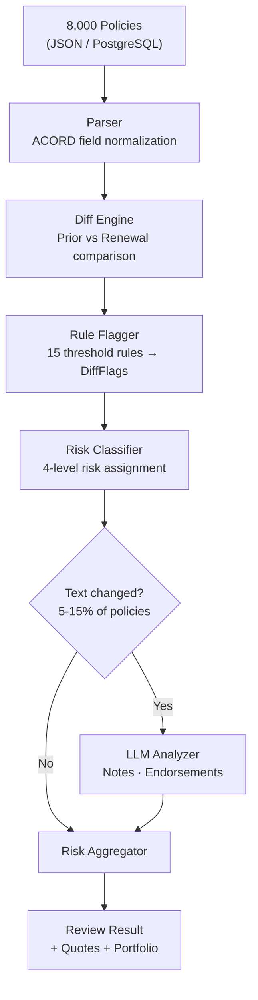
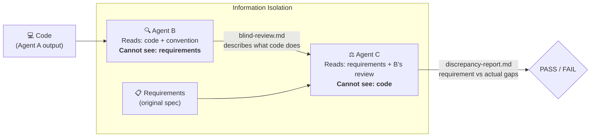
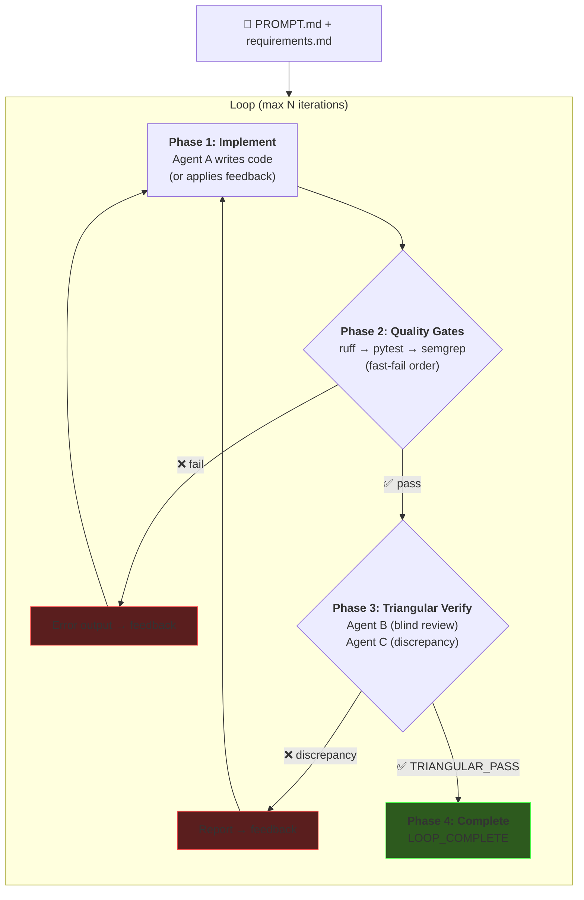

```mermaid {scale: 0.7}
flowchart LR
    E1["<b>Exp 1</b><br/>SubAgent vs<br/>Agent Teams"] --> E2["<b>Exp 2</b><br/>Triangular<br/>Verification"]
    E2 --> E3["<b>Exp 3</b><br/>Self-Correcting<br/>Loop"]
    E3 --> E4["<b>Exp 4</b><br/>Pipeline<br/>Reusability"]
    E4 --> E5["<b>Exp 5</b><br/>Langfuse LLM<br/>Benchmark"]

    style E1 fill:#1e3a5f,stroke:#4a9eff
    style E2 fill:#1e3a5f,stroke:#4a9eff
    style E3 fill:#2d5a1e,stroke:#4aff4a
    style E4 fill:#2d5a1e,stroke:#4aff4a
    style E5 fill:#5a3a1e,stroke:#ffaa4a
```

# Agent-Native Engineering

### Insurance Renewal Review Pipeline

<div class="pt-4 text-gray-400">
8,000 Policies · Rule + LLM Hybrid · 5x Faster
</div>

<div class="pt-6 text-left max-w-2xl mx-auto text-sm text-gray-400 leading-relaxed">

**My Goal**: Set up an agent-native environment, plan thoroughly, then let AI agents execute — compressing a full work week into a day. Along the way, run experiments to find what works and what doesn't, and package the results into reusable workflows for the team.

</div>

<div class="abs-br m-6 flex gap-2 text-sm text-gray-500">
  Yeonsu Choi · Feb 2026
</div>

<!--
오프닝: "8,000건 보험 갱신 정책을 자동으로 심사하는 파이프라인을 만들었습니다.
목표는 세 가지였습니다:
1) agent-native 환경을 셋업하고, 충분히 계획한 다음, AI가 실행하게 해서 5일 걸릴 작업을 하루에 끝내기
2) 그 과정에서 어떤 AI 워크플로우가 효과적인지 실험하기
3) 실험 결과를 팀이 재사용할 수 있는 Skill과 가이드로 패키징하기
이 발표에서는 무엇을 만들었는지, 얼마나 빨랐는지, 그리고 5가지 실험의 결과를 공유하겠습니다."
-->

---
layout: center
class: text-center
---

# The Problem

<div class="text-2xl text-gray-400 py-4">
Brokers manually review 8,000 renewal policies every season
</div>

<div class="grid grid-cols-3 gap-8 pt-8">
<div>
<div class="text-4xl font-bold text-red-400">Days</div>
<div class="text-gray-400 text-sm">of manual comparison</div>
</div>
<div>
<div class="text-4xl font-bold text-red-400">15+</div>
<div class="text-gray-400 text-sm">risk categories to check</div>
</div>
<div>
<div class="text-4xl font-bold text-red-400">Missed</div>
<div class="text-gray-400 text-sm">text-based risk signals</div>
</div>
</div>

<div class="pt-10 text-lg text-gray-300">

My Approach: &nbsp; **Setup** → **Plan** → **Build** → **Experiment** → **Iterate**

</div>

<!--
"보험 갱신 시즌에 브로커가 수천 건의 정책을 하나하나 비교하는데 며칠이 걸립니다.
15개 이상의 리스크 카테고리를 눈으로 체크해야 하고, 메모나 특약 텍스트에 숨어있는 위험 신호는 놓치기 쉽습니다.
저의 접근 방식은 Setup → Plan → Build → Experiment → Iterate.
먼저 환경을 세팅하고, 계획을 세우고, 빠르게 만들고, 실험하고, 반복합니다.
이 흐름대로 발표를 진행하겠습니다."
-->

---

# What I Built

<div class="grid grid-cols-2 gap-4">
<div>



</div>
<div class="pl-4">

### Features

- **Dashboard** — batch processing, risk distribution, policy list
- **Review Detail** — prior vs renewal side-by-side, flags, AI insights
- **Analytics** — batch history, trend charts
- **Quote Generator** — 5 cost-saving strategies per policy type
- **Portfolio Analyzer** — cross-policy bundle analysis, duplication detection
- **LLM Insights** — risk signals from notes, endorsement comparison, personalized broker tips

<div class="pt-4 text-sm text-gray-400">

100 tests · 14+ API endpoints · 7 UI pages · 8,000 policies < 1 second

</div>
</div>
</div>

<!--
"왼쪽이 전체 파이프라인입니다. 구조화된 필드는 100% rule-based로 처리하고,
비정형 텍스트(메모, 특약)만 LLM에 선별 투입합니다. 전체 정책의 5-15%만 LLM을 호출하므로 비용 효율적입니다.
오른쪽은 주요 기능 — 대시보드, 개별 리뷰, 분석, 견적, 포트폴리오 다 포함합니다."
-->

---
layout: center
---

# The Speed Story

<div class="grid grid-cols-3 gap-12 items-center pt-8">
<div class="text-center">
<div class="text-6xl font-bold text-gray-500">5 days</div>
<div class="text-gray-500 pt-2">Manual Development<br/>(~37 hours estimated)</div>
</div>
<div class="text-center">
<div class="text-5xl">→</div>
</div>
<div class="text-center">
<div class="text-6xl font-bold text-green-400">1 day</div>
<div class="text-green-400/70 pt-2">Core System with AI<br/>(~4 hours · 5x speedup)</div>
</div>
</div>

<div class="pt-8 text-center text-sm text-gray-400">
+ 5 experiments on top → total project completed in ~2 days
</div>

<div class="pt-4 text-center">

| Phase | AI Agent | Manual Dev | Speedup |
|-------|----------|------------|---------|
| Models + Parser (ACORD) | 30 min | 4h | 8x |
| Diff Engine + 15 Rules | 45 min | 6h | 8x |
| Mock Data (8,000 policies) | 20 min | 3h | 9x |
| LLM Client + 4 Prompts | 30 min | 5h | 10x |
| Batch + API + Frontend | 75 min | 10h | 8x |

</div>

<!--
"시니어 개발자 기준으로 산정하면 이 시스템은 순수 개발로 약 37시간, 5일 걸리는 작업입니다.
AI agent로 코어 시스템을 하루 만에 완성했습니다. 5배 빠릅니다.
거기에 5가지 실험 — agent 오케스트레이션, 삼각검증, 자가수정 루프, LLM 벤치마크 — 까지 포함해서 총 2일에 완료했습니다.
가장 큰 시간 절약은 도메인 리서치입니다. ACORD 보험 표준을 별도 학습 없이 바로 모델링할 수 있었습니다."
-->

---

# How: Agent-Native Setup

<div class="grid grid-cols-2 gap-8">
<div>

### Rulesets — Agent Behavior Control

```yaml
# CLAUDE.md (loaded every session)
- No docstrings → clear naming + type hints
- Read convention.md before every change
- Minimal diffs only
- Token-aware: grep/glob before full reads
- Pre-commit: Ruff + Gitleaks + Semgrep
```

```yaml
# convention.md
- Files < 300 lines (split when approaching)
- Hexagonal layer rules (domain/ imports nothing)
- StrEnum for finite values, Config for thresholds
- Immutable models, DI via Depends()
```

</div>
<div>

### Quality Gates — Reward Signals

| Gate | Purpose |
|------|---------|
| **pytest** (100 tests) | Agent iterates until all pass |
| **Ruff** | Lint + format — prevents code slop |
| **Gitleaks** | Blocks secrets in commits |
| **Semgrep** | SAST security scanning |
| **Hypothesis** | Property-based edge case testing |

### Claude Code Hooks

| Hook | Type | Action |
|------|------|--------|
| `require-experiment-log` | PreToolUse | Blocks commit without experiment log |
| `require-design-doc` | PreToolUse | Blocks commit if code changed without doc update |
| `remind-design-doc` | PostToolUse | One-time reminder on code edit |

</div>
</div>

<!--
"Agent-native의 핵심은 agent에게 코드를 맡기는 게 아니라, agent가 잘 일할 수 있는 환경을 먼저 만드는 것입니다.
CLAUDE.md와 convention.md로 행동 규칙을 정의하고, 품질 게이트(테스트, 린터, 보안 스캐너)를 agent의 reward signal로 설정합니다.
커밋할 때마다 자동으로 전부 실행되고, 통과하지 못하면 커밋 자체가 불가합니다.
추가로 Claude Code Hook 3개를 만들어서 — 실험 로그 없이 커밋 불가, 코드 변경 시 design-doc 없이 커밋 불가 — 문서 업데이트를 자동으로 강제합니다."
-->

---

# Documentation-Driven Planning

<div class="grid grid-cols-3 gap-6">
<div>

### requirements.md
- FR-1 ~ FR-9 functional requirements
- Success criteria with numbers
- Golden eval scenarios (5 cases)
- Non-functional: <10s for 8,000 policies

</div>
<div>

### design-doc.md
- 5-layer hexagonal architecture
- Data model (8 Pydantic models)
- 15 DiffFlags, 4 risk levels
- API surface (14+ endpoints)
- Auto-updated via hooks

</div>
<div>

### implementation-plan.md
- Phase 0-2C execution roadmap
- Per-phase: files, line estimates, commit message
- V1 (rule) → V2 (LLM) progressive migration
- Feature flag: `RR_LLM_ENABLED`

</div>
</div>

<div class="pt-6 text-center text-gray-400">

*"I didn't ask the agent to 'build me an insurance system.' I gave it a phased plan with exact file names, function signatures, and verification criteria at each step."*

</div>

<!--
"코드를 쓰기 전에 문서 3개를 먼저 작성했습니다.
requirements.md에 기능 요구사항과 성공 기준, design-doc.md에 아키텍처와 데이터 모델,
implementation-plan.md에 Phase별 실행 계획.
Agent에게 '보험 시스템 만들어줘'가 아니라 '이 순서로, 이 구조로, 이 기준을 통과하게' 지시합니다.
그리고 design-doc은 코드 변경 시 훅으로 자동 업데이트를 강제합니다."
-->

---
layout: center
class: text-center
---

# Five Experiments

<div class="text-gray-400 pb-6">
Each experiment answered a specific question about AI-assisted development
</div>



<div class="grid grid-cols-5 gap-4 pt-4 text-xs text-gray-400">
<div class="text-center">"Can I run multiple agents?"</div>
<div class="text-center">"Can agents verify each other?"</div>
<div class="text-center">"Can verify→fix be automated?"</div>
<div class="text-center">"Does the pipeline generalize?"</div>
<div class="text-center">"Which LLM is best for this?"</div>
</div>

<!--
"5가지 실험을 순차적으로 진행했고, 각 실험은 이전 실험의 결과 위에 쌓입니다.
실험 1: 여러 agent를 동시에 돌릴 수 있는가?
실험 2: agent끼리 서로 검증할 수 있는가?
실험 3: 검증부터 수정까지 자동화할 수 있는가?
실험 4: 그 파이프라인이 다른 기능에서도 재사용 가능한가?
실험 5: 어떤 LLM provider가 이 도메인에 최적인가?"
-->

---

# Exp 1: SubAgent vs Agent Teams

<div class="text-sm text-gray-400 pb-2">Same task (Analytics module, ~300 lines) · Two orchestration patterns</div>

<div class="grid grid-cols-2 gap-8">
<div>

### SubAgent Pattern
```
Orchestrator
  ├─ [1] Research subagent (Explore)
  ├─ [2] Model + Service ─┐
  │                        ├─ parallel
  ├─ [3] Routes + Main ───┘
  └─ [4] Tests (after 2,3)
```
**Key**: Orchestrator specifies interface specs in prompt → parallel dispatch possible

</div>
<div>

### Agent Teams Pattern
```
Team Lead
  ├─ TaskCreate: #1 → #2 → #3
  ├─ [spawn] modeler  → task #1
  ├─ [spawn] router   → task #2
  └─ [spawn] tester   → task #3
```
**Key**: Explicit dependency (blockedBy) · Each member reads conventions independently

</div>
</div>

<div class="pt-4">

| Metric | SubAgent | Agent Teams |
|--------|----------|-------------|
| Time | 354s (~6 min) | 318s (~5 min) |
| Code generated | 334 lines, 8 files | 335 lines, 8 files |
| Tests | 73 all pass | 73 all pass |
| Lint fixes needed | 1 (ruff format) | 0 |

</div>

<div class="pt-2 text-sm">

> **Insight**: Small tasks (~300 lines) → SubAgent is simpler. Agent Teams shines at scale with complex dependencies.
> **Limitation**: Task was too small for Teams' advantages. A 1,000+ line multi-module task would differentiate better.

</div>

<!--
"동일한 과제 — Analytics 모듈 추가 — 를 두 가지 방식으로 진행했습니다.
SubAgent는 오케스트레이터가 인터페이스 스펙을 프롬프트에 명시해서 병렬 디스패치합니다.
Agent Teams는 TaskCreate로 태스크를 등록하고 의존성을 설정합니다.
결과는 거의 동일 — 6분 안에 프로덕션 레디 모듈을 생성했습니다.
차이가 없다는 것 자체가 인사이트입니다. 소규모에서는 SubAgent가 실용적이고,
대규모 프로젝트에서 Teams의 태스크 추적/의존성 관리가 빛날 것입니다.
한계를 개선한다면, 1000줄 이상의 멀티모듈 과제로 재실험하면 Teams의 장점이 드러날 것입니다."
-->

---

# Exp 2: Triangular Verification — Concept

<div class="text-sm text-gray-400 pb-2">3-agent information isolation catches what linters and tests cannot</div>



<div class="pt-4">

### Why This Works

| Tool | Catches | Misses |
|------|---------|--------|
| **Ruff** | Syntax, formatting, imports | Intent mismatch |
| **Pytest** | Logic bugs (if test exists) | Missing features |
| **Semgrep** | Security patterns | Business logic gaps |
| **Triangular** | **Intent mismatch**, missing features, extra features | UI-level issues |

</div>

<div class="pt-2 text-sm text-gray-400">

*"The key insight: Agent B doesn't know what the code should do. It describes what the code actually does. Agent C compares that description against requirements — without code bias."*

</div>

<!--
"삼각 검증의 핵심은 정보 격리입니다.
Agent B는 코드와 컨벤션만 보고 '이 코드가 뭘 하는지' 설명합니다. 요구사항은 보지 못합니다.
Agent C는 요구사항과 B의 설명만 보고 '불일치가 있는가' 판단합니다. 코드는 보지 못합니다.
이 세 관점 — 요구사항, 코드, 독립 분석 — 이 일치하면 PASS입니다.
기존 도구(ruff, pytest, semgrep)는 구문과 보안만 체크합니다.
삼각 검증은 '의도대로 만들었는가'를 검증합니다."
-->

---

# Exp 2: Triangular Verification — Results

<div class="text-sm text-gray-400 pb-2">Applied to Analytics module (already passing all linters + tests)</div>

<div class="grid grid-cols-2 gap-8">
<div>

### Issues Found

| Category | Count | Example |
|----------|-------|---------|
| Intent Mismatch | 2 | FIFO 100-entry limit not implemented |
| Missing Feature | 2 | History endpoint behavior gap |
| Extra Feature | 3 | Undocumented features in code |
| Convention Violation | 2 | Timezone hardcoding mismatch |
| False Positive | 2 | — |

<div class="pt-4">

| Metric | Value |
|--------|-------|
| **Precision** | **78%** (7/9 true positives) |
| **Standard tools found** | 0 issues |
| **Triangular found** | 9 issues |
| **Time cost** | ~19 min |

</div>
</div>
<div>

### Critical Finding: FIFO 100-Entry Limit

Requirements said: *"Maximum 100 entries, FIFO"*

Code: unlimited `append()` — no cap

ruff: ✅ &nbsp; pytest: ✅ &nbsp; semgrep: ✅

**Triangular: ❌ FOUND IT**

<div class="pt-6 text-sm">

### Limitations & Improvements

- Agent B can only analyze Python code — **UI/template verification is blind**
- 78% precision means ~22% false positives — could improve with more specific requirements
- ~19 min overhead per run — **worth it for critical features, not every commit**
- **Next step**: Add template/frontend analysis skill to Agent B

</div>
</div>
</div>

<!--
"이미 ruff, pytest, semgrep 전부 통과한 코드를 대상으로 삼각 검증을 실행했습니다.
결과: 표준 도구가 발견한 이슈 0건, 삼각 검증이 발견한 이슈 9건.
가장 중요한 발견은 FIFO 100건 제한 미구현입니다.
요구사항에 '최대 100건, FIFO'라고 수치까지 명시했지만, 코드는 무제한 append였습니다.
ruff는 구문만, pytest는 테스트 케이스에 없으면 모르고, semgrep은 보안 패턴만 체크합니다.
삼각 검증만이 '요구사항에 100건이라 적혀있는데 코드에는 없다'를 발견했습니다.
한계로는 UI 검증이 불가능하고, false positive 22%.
개선한다면 Agent B에 프론트엔드 분석 skill을 추가하면 됩니다."
-->

---

# Exp 3: Self-Correcting Loop — The Automation Pipeline

<div class="text-sm text-gray-400 pb-2">Combining quality gates + triangular verification into one automated loop</div>



<div class="text-center pt-2 text-sm text-gray-400">

**Core Principle**: Failure = Data — failure output becomes the next iteration's input

</div>

<!--
"실험 1에서 '여러 agent를 돌릴 수 있다', 실험 2에서 'agent끼리 검증할 수 있다'를 확인했으니,
이제 '검증부터 수정까지 완전 자동화'를 시도합니다.
PROMPT.md 하나로 기능을 정의하면 — 구현 → 품질 게이트 → 삼각 검증 → 수정 까지 사람 개입 없이 돌아갑니다.
핵심 원칙은 '실패 = 데이터' — 실패 출력이 다음 반복의 입력이 됩니다.
이걸 Claude Skill로 패키징해서 재사용 가능하게 만들었습니다."
-->

---

# Exp 3: Results — Automated vs Manual

<div class="text-sm text-gray-400 pb-2">Task: Smart Quote Generator (5 strategies, models + engine + API + tests)</div>

<div class="grid grid-cols-2 gap-8">
<div>

### Quantitative Comparison

| Metric | Automated Loop | Manual Baseline |
|--------|---------------|-----------------|
| Time | 641s | 549s |
| Iterations | 1 | 1 (+retry) |
| Phase 2 failures | 0 | 0 |
| Phase 3 failures | 0 | 1 |
| **Human interventions** | **0** | **1** |
| Tests passing | 81/81 | 82/82 |
| Triangular result | PASS | PASS (2nd try) |

</div>
<div>

### What Happened in Manual

Agent B reviewed the **wrong module** in the first triangular verification attempt.

The automated script avoids this by using `git diff` to **automatically extract the file list** — a structural fix, not a prompt fix.

### Key Insight

> **Automation value ≠ speed.** The automated loop was 92s slower, but completed with zero human intervention. The manual run needed me to catch and fix an agent prompt error.

> **If improved**: Streaming output instead of `claude --print` buffering would close the speed gap. The reliability advantage remains.

</div>
</div>

<!--
"Smart Quote Generator를 자동 루프와 수동으로 각각 구현했습니다.
자동 루프가 92초 느렸지만 사람 개입 0으로 완료. 수동은 Agent B가 잘못된 모듈을 리뷰해서 수정이 필요했습니다.
자동 스크립트는 git diff로 변경된 파일 목록을 자동 추출하므로 이 문제를 구조적으로 회피합니다.
자동화의 가치는 속도가 아니라 신뢰성입니다.
개선한다면 claude --print의 버퍼링 오버헤드를 스트리밍으로 바꾸면 속도 차이도 줄어듭니다."
-->

---

# Exp 4: Pipeline Reusability

<div class="text-sm text-gray-400 pb-2">Same pipeline, completely different domain feature — Portfolio Risk Aggregator</div>

<div class="grid grid-cols-2 gap-8">
<div>

### Experiment Design

**Same pipeline:**
```
PROMPT.md → Implement → Quality Gates → Triangular Verify
```

**Different feature:**
- Cross-policy bundle analysis
- Carrier mismatch detection
- Premium concentration check
- Duplicate coverage detection

**Different scope:**
- 5 new files, 182 lines engine code
- 8 test cases
- 3 Pydantic models

</div>
<div>

### Results

| Metric | Exp 3 (Quotes) | Exp 4 (Portfolio) |
|--------|----------------|-------------------|
| Iterations | 1 | 1 |
| Human intervention | 0 | 0 |
| Quality gates | All pass | All pass |
| Triangular | PASS | PASS |
| New tests | 8 | 8 |

<div class="pt-4 text-green-400 font-bold">

Pipeline reusability: PROVEN

</div>

<div class="pt-2 text-sm">

> Just swap `PROMPT.md` — the pipeline handles any feature. Packaged as a **Claude Skill** (`self-correcting-loop`) for team reuse.

> **Next step**: Test with cross-module features (e.g., features spanning 3+ layers) to stress-test the pipeline.

</div>
</div>
</div>

<!--
"실험 3의 파이프라인이 다른 도메인에서도 작동하는지 검증했습니다.
Portfolio Risk Aggregator — 완전히 다른 비즈니스 로직을 같은 파이프라인에 넣었더니
1회 반복, 사람 개입 0, 모든 게이트 통과.
PROMPT.md만 바꾸면 어떤 기능이든 자동 구현됩니다.
이걸 Claude Skill로 패키징해서 팀이 재사용할 수 있게 만들었습니다.
개선한다면, 3개 레이어를 동시에 건드는 크로스 모듈 기능으로 스트레스 테스트하면 좋겠습니다."
-->

---

# Exp 5: Langfuse LLM Benchmark

<div class="text-sm text-gray-400 pb-2">Data-driven model selection: 3 models × 3 tasks × 5 cases = 45 evaluations</div>

<div class="grid grid-cols-2 gap-6">
<div>

### Accuracy (key_match avg)

| Task | gpt-4o-mini | Sonnet | Haiku |
|------|-------------|--------|-------|
| Risk Signal | 0.70 | **0.90** | 0.80 |
| Endorsement | 0.70 | **1.00** | **1.00** |
| Coverage | 1.00 | 1.00 | 1.00 |
| **Overall** | **0.80** | **0.97** | **0.93** |

### Speed (avg latency)

| | gpt-4o-mini | Sonnet | Haiku |
|--|-------------|--------|-------|
| Avg | **1.7s** | 3.3s | **1.7s** |

### Cost (per 1M tokens in/out)

| | gpt-4o-mini | Sonnet | Haiku |
|--|-------------|--------|-------|
| Price | $0.15/$0.60 | $3/$15 | $0.25/$1.25 |

</div>
<div>

### Key Findings

1. **Task complexity reveals model gaps** — simple boolean (coverage) = all equal; complex reasoning (risk signal) = Sonnet wins
2. **gpt-4o-mini under-detects** — conservative tendency misses risk signals. In insurance, under-detection > over-detection in danger
3. **Haiku = 90% of Sonnet at 1/10 price** — best cost-performance ratio
4. **Prompt v2 pitfall**: fixing one model broke another. Prompt changes need regression testing across all target models

### Recommendation

| Scenario | Model |
|----------|-------|
| Cost-sensitive | gpt-4o-mini |
| Accuracy-first | Sonnet |
| **Best value (recommended)** | **Haiku** |
| Production hybrid | Haiku + Sonnet for risk-signal |

</div>
</div>

<!--
"Langfuse Datasets + Experiments SDK로 3개 모델을 정량 비교했습니다.
결론: Haiku가 Sonnet의 90% 정확도를 1/10 가격에 제공합니다.
중요한 발견은 gpt-4o-mini가 리스크 시그널을 적게 찾는 경향이 있다는 것.
보험에서는 under-detection이 over-detection보다 위험합니다.
프롬프트 v2도 시도했는데, 한 모델을 고치면 다른 모델이 깨지는 현상을 확인.
프롬프트 변경은 반드시 모든 대상 모델에서 회귀 테스트를 거쳐야 합니다.
현재 5개 테스트 케이스는 방향성 확인용이고, 프로덕션 결정 전 최소 20개 이상 필요합니다."
-->

---

# Architecture: Iterate, Don't Overthink

<div class="text-sm text-gray-400 pb-2">Started fast with flat structure → refactored to hexagonal when boundaries became clear</div>

<div class="grid grid-cols-2 gap-8">
<div>

### Before (Day 1)
```
app/
├── models/        # Pydantic models
├── engine/        # Business logic
├── llm/           # LLM integration
├── routes/        # FastAPI endpoints
└── templates/     # Jinja2 UI
```
<div class="text-sm text-gray-400 pt-2">
Flat structure — fast to build, but domain logic mixed with external dependencies
</div>

</div>
<div>

### After (Day 2)
```
app/
├── domain/        # Pure business logic
│   ├── models/    #   (imports nothing external)
│   ├── services/  #
│   └── ports/     #   Protocol interfaces
├── application/   # Use case orchestration
├── api/           # Inbound adapters (FastAPI)
├── adaptor/       # Outbound (LLM, storage, DB)
└── infra/         # DI wiring
```
<div class="text-sm text-gray-400 pt-2">
Hexagonal — BMS changes stay in adaptor/, domain logic untouched
</div>

</div>
</div>

<div class="pt-4 text-sm">

**AI refactored 44 files** (740 added, 578 deleted) **maintaining 100/100 tests** throughout. Applied 4 design patterns: StrEnum, Config centralization, Immutability (frozen models), DI (Depends()). Convention.md updated so Agent B auto-checks pattern compliance in triangular verification.

> *"Architecture is iteration — build fast, learn the boundaries, then restructure. AI makes the restructuring cost near-zero."*

</div>

<!--
"아키텍처는 정하고 → 반영하고 → 교체하는 iteration의 반복이라 생각합니다.
처음에 기능 구현부터 하고자 해서 flat 구조로 빠르게 만들었고,
경계가 명확해진 시점에 헥사고날로 리팩토링했습니다.
AI가 44개 파일을 리팩토링하면서 100개 테스트를 하나도 깨뜨리지 않았습니다.
BMS가 바뀌어도 adaptor/ 레이어만 수정하면 됩니다.
솔직히 처음부터 아키텍처를 세팅했으면 더 좋았을 텐데, 다시 한다면 convention.md에 레이어 규칙을 처음부터 넣어놓겠습니다."
-->

---

# How I Think About Rule-based vs LLM

<div class="text-sm text-gray-400 pb-2">LLM is not the default — it earns its place through a clear decision framework</div>

<div class="grid grid-cols-2 gap-8">
<div>

### Decision Framework

| Question | → Rule | → LLM |
|----------|--------|-------|
| Is input structured? | ✅ boolean, numeric | free text, notes |
| Is the answer deterministic? | ✅ threshold check | context-dependent |
| Can a simple rule solve it? | ✅ 1-line if | no simple logic |
| Does LLM output feel different? | same quality | ✅ clearly richer |

**If 3+ answers point to Rule → don't use LLM.**

### Where LLM Earned Its Place

| LLM Point | Why It Can't Be Rule-based |
|-----------|---------------------------|
| **Risk Signal Extractor** | Free-text notes → multi-signal reasoning |
| **Endorsement Comparison** | Natural language → material change type |
| **Review Summary** | Multiple flags → coherent 2-3 sentence story |
| **Quote Personalization** | Policy context → tailored broker advice |

</div>
<div>

### The Principle

```
Core pipeline:    100% rule-based (always runs)
LLM layer:        opt-in (RR_LLM_ENABLED flag)
Failure strategy:  graceful fallback to rule-based
User-facing LLM:   4/12 outputs (33%)
Code ratio:         Rule 42% · LLM 19% · Hybrid 25%
```

<div class="pt-4">

**The core engine works without any LLM.** LLM is an additive layer — if every LLM call fails, the system still functions on rule-based results. Users see no difference.

This matters because:
- LLM costs money per call (only 5-15% of policies trigger it)
- LLM latency adds up at batch scale
- Deterministic outputs are easier to test and trust

</div>
</div>
</div>

<div class="pt-2 text-sm text-center text-gray-400">

*"LLM for unstructured text interpretation and multi-context synthesis only. Structured input with deterministic answers → rule-based is more accurate, testable, and cost-effective."*

</div>

<!--
"이 프로젝트에서 LLM을 적용할 때의 판단 기준입니다.
'LLM을 쓸 수 있으니까 쓴다'가 아니라, 4가지 질문을 던져서 3개 이상 Rule을 가리키면 LLM을 쓰지 않습니다.
결과적으로 4개 포인트만 LLM을 사용합니다. 전부 비정형 텍스트를 다루는 작업입니다.
코어 엔진은 100% rule-based이고, LLM은 위에 얹는 additive layer입니다.
LLM이 전부 실패해도 시스템은 정상 동작합니다.
이게 비용, 속도, 테스트 가능성 측면에서 가장 합리적인 구조라고 생각했습니다."
-->

---

# Backend, Domain & Engineering Practices

<div class="grid grid-cols-3 gap-6">
<div>

### DB Integration

```
JSON → Docker Postgres
  ↑ seed_db.py (8,000)
  └ fail → JSON fallback
```

- AI agent solved 4 backend issues in sequence (port conflict, async/sync, ORM, serialization)
- **MCP Toolbox**: Agent queries DB directly via SQL — no scripts needed
- Production: 3 changes (upsert, ingestion API, cache) — pipeline stays the same

</div>
<div>

### Pydantic + LLM Trust

LLM responses = **untrusted external API**:
- 4 Pydantic schemas enforce response format
- Validation failure → rule-based fallback
- Users see no difference on failure

### Domain Knowledge

**Hybrid** (context window is finite):
- `CLAUDE.md`: core terms + pointer
- Custom Skill: full ACORD mapping, gap analysis
- *Like a cache hierarchy — always-needed in L1, rest on demand*

</div>
<div>

### Hooks & Skills

| Name | Action |
|------|--------|
| `require-design-doc` | Blocks commit without doc sync |
| `require-experiment-log` | Blocks commit without log |
| `remind-design-doc` | One-time reminder on edit |
| Skill: `insurance-domain` | ACORD field mapping |
| Skill: `self-correcting-loop` | Automated pipeline |

### Architecture (flat → hexagonal)

AI refactored **44 files** maintaining 100/100 tests. Applied StrEnum, Config, Immutability, DI. Domain layer imports zero external modules.

</div>
</div>

<!--
"몇 가지 기술적 하이라이트입니다.
DB — Docker + Postgres + SQLAlchemy + MCP 연동을 AI agent가 백엔드 이슈 4개를 연쇄적으로 해결해줘서 프론트엔드 개발자인 저도 순조롭게 완료했습니다.
Pydantic — LLM 응답을 외부 API처럼 취급해서 스키마로 계약을 걸고, 실패 시 rule-based fallback.
도메인 지식 — 컨텍스트 윈도우는 유한한 자원이니까, CLAUDE.md에는 핵심만, 상세는 Custom Skill에 분리했습니다.
훅 — 코드 변경 시 design-doc 없이 커밋 불가, 실험 브랜치에서 로그 없이 커밋 불가.
아키텍처 — flat 구조에서 시작해서 경계가 명확해진 시점에 헥사고날로 리팩토링했습니다. AI가 44파일을 테스트 깨지 않고 리팩토링했습니다."
-->

---

# Skills for the Team

<div class="text-sm text-gray-400 pb-2">Packaging experiments into reusable workflows anyone can adopt</div>

<div class="grid grid-cols-2 gap-8">
<div>

### What I Packaged

**Claude Skill: `self-correcting-loop`**
```
PROMPT.md → Implement → Quality Gates → Triangular Verify
                 ↑___________ feedback ___________↓
```
- Any engineer runs it with one command
- Swap `PROMPT.md` for any feature
- Proven on 2 different domain features (Exp 3 & 4)

**Team Guide: `guide-self-correcting-loop.md`**
- Prerequisites, step-by-step usage
- Troubleshooting section
- Shell script + Skill invocation methods

</div>
<div>

### Why This Matters

Skills are **organizational knowledge**, not personal tools.

At Quandri, I've heard that engineers use their own individual skills — but good patterns aren't shared across the engineering org yet.

What if the best workflows from one team could be installed by another with a single file?

```
~/.claude/skills/self-correcting-loop/
└── SKILL.md   ← install this, get the whole pipeline
```

**One engineer experiments → packages it → whole team benefits.**

This is what I want to bring: not just building fast, but making the team faster.

</div>
</div>

<!--
"실험 결과를 Skill과 가이드로 패키징했습니다.
self-correcting-loop Skill — PROMPT.md만 바꾸면 어떤 기능이든 자동 구현+검증 파이프라인을 돌릴 수 있습니다.
가이드 문서도 만들어서 팀원 누구나 따라할 수 있게 했습니다.
Quandri에서 Chloe와 이야기했을 때, 지금은 각 엔지니어가 자기만의 Skill을 쓰고 있고
좋은 패턴이 엔지니어링 조직 전체에 공유되지 않는다고 들었습니다.
한 사람이 실험하고, 패키징하고, 팀 전체가 쓸 수 있게 만드는 것 — 이게 제가 가져가고 싶은 방식입니다.
빠르게 만드는 것뿐 아니라, 팀 전체를 빠르게 만드는 것."
-->

---
layout: center
---

# What I'd Improve

<div class="grid grid-cols-2 gap-8 pt-4">
<div>

### Limitations Identified

- **Triangular verification blind to UI** — Agent B only reads Python; templates unchecked
- **5 test cases insufficient** for statistically significant LLM benchmark — need 20+
- **Prompt v2 cross-model regression** — improving one model can degrade another
- **Self-correcting loop speed** — `claude --print` buffering adds ~90s overhead
- **Hexagonal was added late** — should have been in convention.md from day 1

</div>
<div>

### If I Had More Time

- Add **frontend analysis skill** to Agent B for template/JS verification
- Expand Langfuse test cases to **30+** for production model selection
- Build **model-specific prompt variants** instead of one-size-fits-all
- Add **streaming output** to self-correcting loop for real-time feedback
- Create **architecture-aware skill** that enforces layer boundaries from the start
- Implement **batch ingestion API** (`POST /ingest/batch`) for production BMS integration

</div>
</div>

<div class="pt-8 text-center text-xl">

> *"Agent-native isn't about delegating code to AI. It's about building an environment where AI can do its best work — rulesets, quality gates, clear plans. Then a week of work becomes two days."*

</div>

<!--
"한계와 개선 방향입니다.
삼각 검증은 UI를 못 봅니다 — 프론트엔드 분석 skill을 추가하면 됩니다.
Langfuse 테스트 케이스 5개는 부족합니다 — 프로덕션 결정 전 30개 이상 필요합니다.
프롬프트 개선은 모든 대상 모델에서 회귀 테스트가 필수입니다.
헥사고날 아키텍처는 늦게 추가했는데, 다시 한다면 처음부터 convention.md에 넣겠습니다.
Agent-native는 AI에게 코드를 맡기는 게 아니라, AI가 잘 일할 수 있는 환경을 만드는 것입니다."
-->

---
layout: center
class: text-center
---

# Q & A

<div class="pt-8 text-gray-400">

**Tech Stack**: Python 3.13 · FastAPI · Pydantic v2 · SQLAlchemy · Docker · PostgreSQL

**AI Tools**: Claude Code · Langfuse · MCP Toolbox · Custom Skills & Hooks

**Metrics**: 100 tests · 14+ endpoints · 8,000 policies < 1s · ~2,500 lines · 2 days

</div>

<div class="pt-12 text-sm text-gray-500">

github.com/[repo] · Yeonsu Choi

</div>

<!--
"감사합니다. 질문 있으시면 말씀해 주세요."

예상 Q&A:

Q1: "삼각검증으로 구현할 기능들을 큐에 어떻게 넣고 어떻게 보나요?"
A: "디렉토리 기반입니다. docs/experiments/에 requirements + PROMPT 파일을 넣으면 파이프라인이 읽어갑니다.
실행 로그는 docs/logs/loop-execution.log에, 검증 결과는 blind-review.md와 discrepancy-report.md에 자동 생성됩니다.
팀에서 쓸 때는 가이드 문서(guide-self-correcting-loop.md)를 따르면 됩니다."

Q2: "데이터 8,000건이 끝이 아니라 계속 들어올텐데 어떻게 하나요?"
A: "실제로는 보험사가 갱신 시즌에 BMS로 배치 데이터를 내려보내고 Epic SDK로 주기적으로 가져옵니다.
바꿔야 할 건 3가지 — upsert로 중복 방지, 배치 ingestion API 추가, 캐시 무효화.
분석 파이프라인(diff → flag → risk)은 그대로 사용합니다.
DataSourcePort 인터페이스 덕분에 JSON → DB 전환도 코드 1파일 변경이었습니다."

Q3: "프론트엔드 배경인데 백엔드는 어떻게?"
A: "솔직히 Docker + PostgreSQL + SQLAlchemy는 처음이었습니다.
AI agent가 포트 충돌, async/sync 호환, ORM 매핑 문제를 연쇄적으로 진단하고 수정해줘서 순조롭게 완료했습니다.
이게 agent-native의 장점입니다 — 모르는 영역도 agent와 함께 빠르게 학습하고 구현할 수 있습니다."
-->
