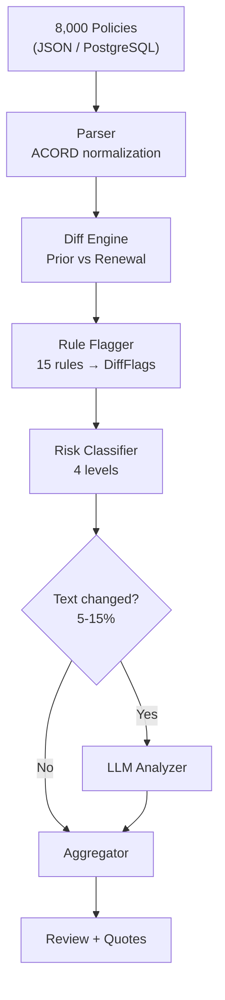
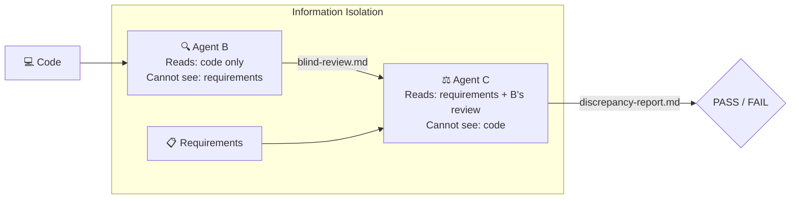
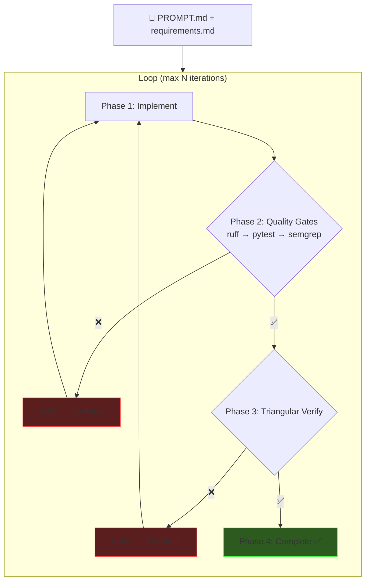

# Agent-Native Engineering

### Insurance Renewal Review Pipeline

<div class="pt-4 text-gray-400">
8,000 Policies · Rule + LLM Hybrid · 5x Faster
</div>

<div class="pt-6 text-left max-w-2xl mx-auto text-sm text-gray-400 leading-snug">

**Goal**: Agent-native setup → plan thoroughly → AI executes — compress a work week into a day. Experiment & package reusable workflows for the team.

</div>

<div class="abs-br m-6 flex gap-2 text-sm text-gray-500">
  Yeonsu Choi · Feb 2026
</div>

<!--
오프닝: "8,000건 보험 갱신 정책을 자동으로 심사하는 파이프라인을 만들었습니다.
목표는 세 가지였습니다:
1) agent-native 환경을 셋업하고, 충분히 계획한 다음, AI가 실행하게 해서 5일 걸릴 작업을 하루에 끝내기
2) 그 과정에서 어떤 AI 워크플로우가 효과적인지 실험하기
3) 실험 결과를 팀이 재사용할 수 있는 Skill과 가이드로 패키징하기
이 발표에서는 무엇을 만들었는지, 얼마나 빨랐는지, 그리고 5가지 실험의 결과를 공유하겠습니다."
-->

---
layout: center
class: text-center
---

# The Problem

<div class="text-xl text-gray-400 py-2">
Brokers manually review 8,000 renewal policies every season
</div>

<div class="grid grid-cols-3 gap-8 pt-6">
<div>
<div class="text-4xl font-bold text-red-400">Days</div>
<div class="text-gray-400 text-xs">manual comparison</div>
</div>
<div>
<div class="text-4xl font-bold text-red-400">15+</div>
<div class="text-gray-400 text-xs">risk categories</div>
</div>
<div>
<div class="text-4xl font-bold text-red-400">Missed</div>
<div class="text-gray-400 text-xs">text-based signals</div>
</div>
</div>

<div class="pt-8 text-base text-gray-300">

**Setup** → **Plan** → **Build** → **Experiment** → **Iterate**

</div>

<!--
"보험 갱신 시즌에 브로커가 수천 건의 정책을 하나하나 비교하는데 며칠이 걸립니다.
15개 이상의 리스크 카테고리를 눈으로 체크해야 하고, 메모나 특약 텍스트에 숨어있는 위험 신호는 놓치기 쉽습니다.
저의 접근 방식은 Setup → Plan → Build → Experiment → Iterate.
먼저 환경을 세팅하고, 계획을 세우고, 빠르게 만들고, 실험하고, 반복합니다.
이 흐름대로 발표를 진행하겠습니다."
-->

---

# What I Built

<div class="grid grid-cols-2 gap-4">
<div>



</div>
<div class="pl-4 text-sm">

### Features

- **Dashboard** — batch, risk overview
- **Review Detail** — prior vs renewal diff
- **Analytics** — history, trends
- **Quote Generator** — 5 saving strategies
- **Portfolio Analyzer** — bundles, duplicates
- **LLM Insights** — risk signals, broker tips

<div class="pt-2 text-xs text-gray-400">
100 tests · 14+ endpoints · 7 pages · 8,000 policies < 1s
</div>
</div>
</div>

<!--
"왼쪽이 전체 파이프라인입니다. 구조화된 필드는 100% rule-based로 처리하고,
비정형 텍스트(메모, 특약)만 LLM에 선별 투입합니다. 전체 정책의 5-15%만 LLM을 호출하므로 비용 효율적입니다.
오른쪽은 주요 기능 — 대시보드, 개별 리뷰, 분석, 견적, 포트폴리오 다 포함합니다."
-->

---
layout: center
---

# The Speed Story

<div class="grid grid-cols-3 gap-12 items-center pt-4">
<div class="text-center">
<div class="text-5xl font-bold text-gray-500">5 days</div>
<div class="text-gray-500 pt-1 text-sm">Manual (~37h estimated)</div>
</div>
<div class="text-center">
<div class="text-4xl">→</div>
</div>
<div class="text-center">
<div class="text-5xl font-bold text-green-400">1 day</div>
<div class="text-green-400/70 pt-1 text-sm">With AI (~4h · 5x)</div>
</div>
</div>

<div class="pt-4 text-center text-xs text-gray-400">
+ 5 experiments → total ~2 days
</div>

<div class="pt-2 text-center text-xs">

| Phase | AI | Manual | Speedup |
|-------|-----|--------|---------|
| Models + Parser (ACORD) | 30 min | 4h | 8x |
| Diff Engine + 15 Rules | 45 min | 6h | 8x |
| Mock Data (8,000) | 20 min | 3h | 9x |
| LLM Client + Prompts | 30 min | 5h | 10x |
| Batch + API + Frontend | 75 min | 10h | 8x |

</div>

<!--
"시니어 개발자 기준으로 산정하면 이 시스템은 순수 개발로 약 37시간, 5일 걸리는 작업입니다.
AI agent로 코어 시스템을 하루 만에 완성했습니다. 5배 빠릅니다.
거기에 5가지 실험 — agent 오케스트레이션, 삼각검증, 자가수정 루프, LLM 벤치마크 — 까지 포함해서 총 2일에 완료했습니다.
가장 큰 시간 절약은 도메인 리서치입니다. ACORD 보험 표준을 별도 학습 없이 바로 모델링할 수 있었습니다."
-->

---

# How: Agent-Native Setup

<div class="grid grid-cols-2 gap-6 text-xs">
<div>

### Rulesets — Agent Behavior

```yaml
# CLAUDE.md (every session)
- No docstrings → naming + types
- Read convention.md first
- Minimal diffs, token-aware
- Pre-commit: Ruff + Gitleaks + Semgrep
```

```yaml
# convention.md
- Files < 300 lines
- Hexagonal layers (domain/ imports nothing)
- StrEnum, Config, Immutable models
```

</div>
<div>

### Quality Gates — Reward Signals

| Gate | Purpose |
|------|---------|
| **pytest** (100) | Iterate until pass |
| **Ruff** | Lint + format |
| **Gitleaks** | Block secrets |
| **Semgrep** | SAST scanning |
| **Hypothesis** | Property-based tests |

### Claude Code Hooks

| Hook | Action |
|------|--------|
| `require-experiment-log` | Block commit w/o log |
| `require-design-doc` | Block commit w/o doc |
| `remind-design-doc` | Remind on code edit |

</div>
</div>

<!--
"Agent-native의 핵심은 agent에게 코드를 맡기는 게 아니라, agent가 잘 일할 수 있는 환경을 먼저 만드는 것입니다.
CLAUDE.md와 convention.md로 행동 규칙을 정의하고, 품질 게이트(테스트, 린터, 보안 스캐너)를 agent의 reward signal로 설정합니다.
커밋할 때마다 자동으로 전부 실행되고, 통과하지 못하면 커밋 자체가 불가합니다.
추가로 Claude Code Hook 3개를 만들어서 — 실험 로그 없이 커밋 불가, 코드 변경 시 design-doc 없이 커밋 불가 — 문서 업데이트를 자동으로 강제합니다."
-->

---

# Documentation-Driven Planning

<div class="grid grid-cols-3 gap-6 text-sm">
<div>

### requirements.md
- FR-1~9 functional specs
- Success criteria w/ numbers
- 5 golden eval scenarios
- NFR: <10s for 8,000 policies

</div>
<div>

### design-doc.md
- 5-layer hexagonal arch
- 8 Pydantic models
- 15 DiffFlags, 4 risk levels
- 14+ API endpoints
- Auto-updated via hooks

</div>
<div>

### implementation-plan.md
- Phase 0-2C roadmap
- Per-phase: files, lines, commit msg
- V1 (rule) → V2 (LLM) migration
- Feature flag: `RR_LLM_ENABLED`

</div>
</div>

<div class="pt-6 text-center text-sm text-gray-400">

*"Not 'build me an insurance system' — but a phased plan with exact files, signatures, and verification criteria."*

</div>

<!--
"코드를 쓰기 전에 문서 3개를 먼저 작성했습니다.
requirements.md에 기능 요구사항과 성공 기준, design-doc.md에 아키텍처와 데이터 모델,
implementation-plan.md에 Phase별 실행 계획.
Agent에게 '보험 시스템 만들어줘'가 아니라 '이 순서로, 이 구조로, 이 기준을 통과하게' 지시합니다.
그리고 design-doc은 코드 변경 시 훅으로 자동 업데이트를 강제합니다."
-->

---
layout: center
class: text-center
---

# Five Experiments

<div class="text-sm text-gray-400 pb-4">
Each answered a specific question about AI-assisted development

```mermaid {scale: 0.7}
flowchart LR
    E1["<b>Exp 1</b><br/>SubAgent vs<br/>Agent Teams"] --> E2["<b>Exp 2</b><br/>Triangular<br/>Verification"]
    E2 --> E3["<b>Exp 3</b><br/>Self-Correcting<br/>Loop"]
    E3 --> E4["<b>Exp 4</b><br/>Pipeline<br/>Reusability"]
    E4 --> E5["<b>Exp 5</b><br/>Langfuse LLM<br/>Benchmark"]

    style E1 fill:#1e3a5f,stroke:#4a9eff
    style E2 fill:#1e3a5f,stroke:#4a9eff
    style E3 fill:#2d5a1e,stroke:#4aff4a
    style E4 fill:#2d5a1e,stroke:#4aff4a
    style E5 fill:#5a3a1e,stroke:#ffaa4a
```

</div>



<div class="grid grid-cols-5 gap-4 pt-2 text-xs text-gray-400">
<div class="text-center">Multiple agents?</div>
<div class="text-center">Agents verify each other?</div>
<div class="text-center">Automate verify→fix?</div>
<div class="text-center">Pipeline generalizes?</div>
<div class="text-center">Which LLM is best?</div>
</div>

<!--
"5가지 실험을 순차적으로 진행했고, 각 실험은 이전 실험의 결과 위에 쌓입니다.
실험 1: 여러 agent를 동시에 돌릴 수 있는가?
실험 2: agent끼리 서로 검증할 수 있는가?
실험 3: 검증부터 수정까지 자동화할 수 있는가?
실험 4: 그 파이프라인이 다른 기능에서도 재사용 가능한가?
실험 5: 어떤 LLM provider가 이 도메인에 최적인가?"
-->

---

# Exp 1: SubAgent vs Agent Teams

<div class="text-xs text-gray-400 pb-1">Same task (Analytics module, ~300 lines) · Two orchestration patterns</div>

<div class="grid grid-cols-2 gap-6 text-xs">
<div>

### SubAgent Pattern
```
Orchestrator
  ├─ [1] Research (Explore)
  ├─ [2] Model + Service ─┐
  │                        ├─ parallel
  ├─ [3] Routes + Main ───┘
  └─ [4] Tests (after 2,3)
```
**Key**: Interface specs in prompt → parallel dispatch

</div>
<div>

### Agent Teams Pattern
```
Team Lead
  ├─ TaskCreate: #1 → #2 → #3
  ├─ [spawn] modeler  → task #1
  ├─ [spawn] router   → task #2
  └─ [spawn] tester   → task #3
```
**Key**: Explicit dependency (blockedBy)

</div>
</div>

<div class="pt-2 text-xs">

| Metric | SubAgent | Agent Teams |
|--------|----------|-------------|
| Time | 354s (~6 min) | 318s (~5 min) |
| Code | 334 lines, 8 files | 335 lines, 8 files |
| Tests | 73 all pass | 73 all pass |
| Lint fixes | 1 | 0 |

</div>

<div class="pt-2 text-xs text-gray-400">

> **Insight**: ~300 lines → SubAgent simpler. Agent Teams shines at scale with complex dependencies.

</div>

<!--
"동일한 과제 — Analytics 모듈 추가 — 를 두 가지 방식으로 진행했습니다.
SubAgent는 오케스트레이터가 인터페이스 스펙을 프롬프트에 명시해서 병렬 디스패치합니다.
Agent Teams는 TaskCreate로 태스크를 등록하고 의존성을 설정합니다.
결과는 거의 동일 — 6분 안에 프로덕션 레디 모듈을 생성했습니다.
차이가 없다는 것 자체가 인사이트입니다. 소규모에서는 SubAgent가 실용적이고,
대규모 프로젝트에서 Teams의 태스크 추적/의존성 관리가 빛날 것입니다.
한계를 개선한다면, 1000줄 이상의 멀티모듈 과제로 재실험하면 Teams의 장점이 드러날 것입니다."
-->

---

# Exp 2: Triangular Verification — Concept

<div class="text-xs text-gray-400 pb-1">3-agent information isolation catches what linters and tests cannot</div>



<div class="pt-1 text-xs">

| Tool | Catches | Misses |
|------|---------|--------|
| **Ruff / Semgrep** | Syntax, security | Intent mismatch |
| **Pytest** | Logic bugs (if test exists) | Missing features |
| **Triangular** | **Intent mismatch, missing/extra features** | UI-level |

</div>

<div class="pt-1 text-xs text-gray-400">

*Agent B describes what code does (without knowing intent). Agent C compares against requirements (without seeing code).*

</div>

<!--
"삼각 검증의 핵심은 정보 격리입니다.
Agent B는 코드와 컨벤션만 보고 '이 코드가 뭘 하는지' 설명합니다. 요구사항은 보지 못합니다.
Agent C는 요구사항과 B의 설명만 보고 '불일치가 있는가' 판단합니다. 코드는 보지 못합니다.
이 세 관점 — 요구사항, 코드, 독립 분석 — 이 일치하면 PASS입니다.
기존 도구(ruff, pytest, semgrep)는 구문과 보안만 체크합니다.
삼각 검증은 '의도대로 만들었는가'를 검증합니다."
-->

---

# Exp 2: Triangular Verification — Results

<div class="text-xs text-gray-400 pb-1">Applied to code already passing all linters + tests</div>

<div class="grid grid-cols-2 gap-6 text-xs">
<div>

### Issues Found

| Category | Count |
|----------|-------|
| Intent Mismatch | 2 |
| Missing Feature | 2 |
| Extra Feature | 3 |
| Convention Violation | 2 |
| False Positive | 2 |

| Metric | Value |
|--------|-------|
| **Precision** | **78%** (7/9 true) |
| Standard tools | 0 issues |
| Triangular | **9 issues** |
| Time | ~19 min |

</div>
<div>

### Critical: FIFO 100-Entry Limit

Requirement: *"Maximum 100 entries, FIFO"*

Code: unlimited `append()` — no cap

ruff ✅ &nbsp; pytest ✅ &nbsp; semgrep ✅ &nbsp; **Triangular ❌ FOUND**

<div class="pt-4">

### Limitations
- Agent B: Python only — **UI blind**
- 78% precision — ~22% false positives
- ~19 min — worth it for critical features, not every commit

</div>
</div>
</div>

<!--
"이미 ruff, pytest, semgrep 전부 통과한 코드를 대상으로 삼각 검증을 실행했습니다.
결과: 표준 도구가 발견한 이슈 0건, 삼각 검증이 발견한 이슈 9건.
가장 중요한 발견은 FIFO 100건 제한 미구현입니다.
요구사항에 '최대 100건, FIFO'라고 수치까지 명시했지만, 코드는 무제한 append였습니다.
ruff는 구문만, pytest는 테스트 케이스에 없으면 모르고, semgrep은 보안 패턴만 체크합니다.
삼각 검증만이 '요구사항에 100건이라 적혀있는데 코드에는 없다'를 발견했습니다.
한계로는 UI 검증이 불가능하고, false positive 22%.
개선한다면 Agent B에 프론트엔드 분석 skill을 추가하면 됩니다."
-->

---

# Exp 3: Self-Correcting Loop

<div class="text-xs text-gray-400 pb-1">Quality gates + triangular verification in one automated loop</div>



<div class="text-center pt-1 text-xs text-gray-400">

**Failure = Data** — failure output becomes next iteration's input

</div>

<!--
"실험 1에서 '여러 agent를 돌릴 수 있다', 실험 2에서 'agent끼리 검증할 수 있다'를 확인했으니,
이제 '검증부터 수정까지 완전 자동화'를 시도합니다.
PROMPT.md 하나로 기능을 정의하면 — 구현 → 품질 게이트 → 삼각 검증 → 수정 까지 사람 개입 없이 돌아갑니다.
핵심 원칙은 '실패 = 데이터' — 실패 출력이 다음 반복의 입력이 됩니다.
이걸 Claude Skill로 패키징해서 재사용 가능하게 만들었습니다."
-->

---

# Exp 3: Results — Automated vs Manual

<div class="text-xs text-gray-400 pb-1">Task: Quote Generator (5 strategies, models + engine + API + tests)</div>

<div class="grid grid-cols-2 gap-6">
<div class="text-xs">

### Comparison

| Metric | Automated | Manual |
|--------|-----------|--------|
| Time | 641s | 549s |
| Iterations | 1 | 1 (+retry) |
| Phase 2 fails | 0 | 0 |
| Phase 3 fails | 0 | 1 |
| **Human intervention** | **0** | **1** |
| Tests | 81/81 ✅ | 82/82 ✅ |
| Triangular | PASS | PASS (2nd) |

</div>
<div class="text-xs">

### What Happened

Manual: Agent B reviewed the **wrong module** in first triangular run.

Automated: `git diff` **auto-extracts file list** — structural fix, not prompt fix.

<div class="pt-4">

### Insight

> **Value ≠ speed.** Automated was 92s slower but **zero human intervention**. Manual needed me to catch an agent error.

> Streaming output (vs `claude --print` buffering) would close the speed gap.

</div>
</div>
</div>

<!--
"Smart Quote Generator를 자동 루프와 수동으로 각각 구현했습니다.
자동 루프가 92초 느렸지만 사람 개입 0으로 완료. 수동은 Agent B가 잘못된 모듈을 리뷰해서 수정이 필요했습니다.
자동 스크립트는 git diff로 변경된 파일 목록을 자동 추출하므로 이 문제를 구조적으로 회피합니다.
자동화의 가치는 속도가 아니라 신뢰성입니다.
개선한다면 claude --print의 버퍼링 오버헤드를 스트리밍으로 바꾸면 속도 차이도 줄어듭니다."
-->

---

# Exp 4: Pipeline Reusability

<div class="text-xs text-gray-400 pb-1">Same pipeline, different feature — Portfolio Risk Aggregator</div>

<div class="grid grid-cols-2 gap-6">
<div class="text-xs">

### Design

**Same pipeline:**
```
PROMPT.md → Implement → Gates → Triangular
```

**Different feature:**
- Cross-policy bundle analysis
- Carrier mismatch detection
- Duplicate coverage check
- 5 files, 182 lines, 8 tests

</div>
<div class="text-xs">

### Results

| Metric | Exp 3 (Quotes) | Exp 4 (Portfolio) |
|--------|----------------|-------------------|
| Iterations | 1 | 1 |
| Human intervention | 0 | 0 |
| Quality gates | All pass | All pass |
| Triangular | PASS | PASS |

<div class="pt-3 text-green-400 font-bold text-sm">
Pipeline reusability: PROVEN
</div>

> Swap `PROMPT.md` → pipeline handles any feature. Packaged as **Claude Skill**.

</div>
</div>

<!--
"실험 3의 파이프라인이 다른 도메인에서도 작동하는지 검증했습니다.
Portfolio Risk Aggregator — 완전히 다른 비즈니스 로직을 같은 파이프라인에 넣었더니
1회 반복, 사람 개입 0, 모든 게이트 통과.
PROMPT.md만 바꾸면 어떤 기능이든 자동 구현됩니다.
이걸 Claude Skill로 패키징해서 팀이 재사용할 수 있게 만들었습니다.
개선한다면, 3개 레이어를 동시에 건드는 크로스 모듈 기능으로 스트레스 테스트하면 좋겠습니다."
-->

---

# Exp 5: Langfuse LLM Benchmark

<div class="text-xs text-gray-400 pb-1">3 models × 3 tasks × 5 cases = 45 evaluations</div>

<div class="grid grid-cols-2 gap-4 text-xs">
<div>

### Accuracy (key_match avg)

| Task | gpt-4o-mini | Sonnet | Haiku |
|------|-------------|--------|-------|
| Risk Signal | 0.70 | **0.90** | 0.80 |
| Endorsement | 0.70 | **1.00** | **1.00** |
| Coverage | 1.00 | 1.00 | 1.00 |
| **Overall** | **0.80** | **0.97** | **0.93** |

**Speed**: mini 1.7s · Sonnet 3.3s · Haiku 1.7s
**Cost**: Haiku ≈ Sonnet 90% accuracy at 1/10 price

</div>
<div>

### Per-Task Model Routing (Implemented)

| Task | Model | Why |
|------|-------|-----|
| **risk_signal** | **Sonnet 4.5** | Under-detection dangerous |
| endorsement | Haiku 4.5 | Same accuracy, 10x cheaper |
| review_summary | Haiku 4.5 | No complex reasoning |
| quote_personalization | Haiku 4.5 | Haiku sufficient |

<div class="pt-1 text-[10px] text-gray-500">

| | Sonnet 4.5 | Haiku 4.5 |
|--|-----------|-----------|
| **ID** | `claude-sonnet-4-5-20250929` | `claude-haiku-4-5-20251001` |
| **Cost** | $3 / $15 per MTok | $1 / $5 per MTok |
| **Context** | 200K (1M beta) | 200K |

</div>

### Key Findings
- Simple tasks → all equal; complex → Sonnet wins
- gpt-4o-mini under-detects risk signals
- Prompt v2: fixing one model broke another

</div>
</div>

<!--
"Langfuse Datasets + Experiments SDK로 3개 모델을 정량 비교했습니다.
결론: Haiku가 Sonnet의 90% 정확도를 1/10 가격에 제공합니다.
중요한 발견은 gpt-4o-mini가 리스크 시그널을 적게 찾는 경향이 있다는 것.
보험에서는 under-detection이 over-detection보다 위험합니다.
이 벤치마크 결과를 반영해서 task별 모델 라우팅을 실제로 구현했습니다.
risk_signal만 Sonnet, 나머지 3개는 Haiku — LLMClient가 trace_name으로 자동 라우팅합니다.
프롬프트 v2도 시도했는데, 한 모델을 고치면 다른 모델이 깨지는 현상을 확인.
프롬프트 변경은 반드시 모든 대상 모델에서 회귀 테스트를 거쳐야 합니다."
-->

---

# Architecture: Iterate, Don't Overthink

<div class="text-xs text-gray-400 pb-1">Fast flat structure → hexagonal when boundaries became clear</div>

<div class="grid grid-cols-2 gap-6 text-xs">
<div>

### Day 1 — Flat
```
app/
├── models/        # Pydantic
├── engine/        # Business logic
├── llm/           # LLM integration
├── routes/        # FastAPI
└── templates/     # Jinja2
```
<div class="text-gray-400 pt-1">
Fast to build, but domain mixed with externals
</div>

</div>
<div>

### Day 2 — Hexagonal
```
app/
├── domain/        # Pure logic
│   ├── models/    #   (imports nothing)
│   ├── services/
│   └── ports/     #   Protocol interfaces
├── application/   # Use case orchestration
├── api/           # Inbound (FastAPI)
├── adaptor/       # Outbound (LLM, DB)
└── infra/         # DI wiring
```
<div class="text-gray-400 pt-1">
BMS changes → adaptor/ only, domain untouched
</div>

</div>
</div>

<div class="pt-3 text-xs">

AI refactored **44 files** (740+, 578-) maintaining **100/100 tests**. StrEnum, Config, Immutability, DI patterns applied.

> *"Build fast, learn boundaries, restructure. AI makes restructuring cost near-zero."*

</div>

<!--
"아키텍처는 정하고 → 반영하고 → 교체하는 iteration의 반복이라 생각합니다.
처음에 기능 구현부터 하고자 해서 flat 구조로 빠르게 만들었고,
경계가 명확해진 시점에 헥사고날로 리팩토링했습니다.
AI가 44개 파일을 리팩토링하면서 100개 테스트를 하나도 깨뜨리지 않았습니다.
BMS가 바뀌어도 adaptor/ 레이어만 수정하면 됩니다.
솔직히 처음부터 아키텍처를 세팅했으면 더 좋았을 텐데, 다시 한다면 convention.md에 레이어 규칙을 처음부터 넣어놓겠습니다."
-->

---

# Rule-based vs LLM

<div class="text-xs text-gray-400 pb-1">LLM earns its place through a clear decision framework</div>

<div class="grid grid-cols-2 gap-6 text-xs">
<div>

### Decision Framework

| Question | → Rule | → LLM |
|----------|--------|-------|
| Structured input? | ✅ boolean, numeric | free text |
| Deterministic? | ✅ threshold | context-dependent |
| Simple rule? | ✅ 1-line if | no simple logic |
| LLM output richer? | same quality | ✅ clearly richer |

**3+ answers → Rule: don't use LLM.**

### Where LLM Earned Its Place

| Point | Why Not Rule |
|-------|-------------|
| **Risk Signal** | Free-text → multi-signal reasoning |
| **Endorsement** | NL → material change type |
| **Summary** | Flags → coherent story |
| **Quote** | Context → tailored advice |

</div>
<div>

### The Principle

```
Core pipeline:   100% rule-based (always runs)
LLM layer:       opt-in (RR_LLM_ENABLED)
Failure:         graceful fallback to rules
User-facing LLM: 4/12 outputs (33%)
Code ratio:      Rule 42% · LLM 19% · Hybrid 25%
```

<div class="pt-3">

**Core works without any LLM.** LLM is additive — if all LLM calls fail, system functions on rules alone.

- Only 5-15% of policies trigger LLM
- Deterministic = easier to test & trust
- Cost scales with text changes, not policy count

</div>
</div>
</div>

<!--
"이 프로젝트에서 LLM을 적용할 때의 판단 기준입니다.
'LLM을 쓸 수 있으니까 쓴다'가 아니라, 4가지 질문을 던져서 3개 이상 Rule을 가리키면 LLM을 쓰지 않습니다.
결과적으로 4개 포인트만 LLM을 사용합니다. 전부 비정형 텍스트를 다루는 작업입니다.
코어 엔진은 100% rule-based이고, LLM은 위에 얹는 additive layer입니다.
LLM이 전부 실패해도 시스템은 정상 동작합니다.
이게 비용, 속도, 테스트 가능성 측면에서 가장 합리적인 구조라고 생각했습니다."
-->

---

# Backend, Domain & Engineering

<div class="grid grid-cols-3 gap-4 text-xs">
<div>

### DB Integration

```
JSON → Docker Postgres
  ↑ seed_db.py (8,000)
  └ fail → JSON fallback
```

- AI solved 4 backend issues in sequence
- **MCP Toolbox**: Agent queries DB via SQL
- Production: 3 changes (upsert, API, cache)

</div>
<div>

### Pydantic + LLM Trust

LLM response = **untrusted external API**
- 4 schemas enforce format
- Fail → rule-based fallback
- Users see no difference

### Domain Knowledge

- `CLAUDE.md`: core terms (L1 cache)
- Custom Skill: full ACORD mapping (L2)

</div>
<div>

### Hooks & Skills

| Name | Action |
|------|--------|
| `require-design-doc` | Block commit w/o doc |
| `require-experiment-log` | Block commit w/o log |
| Skill: `insurance-domain` | ACORD mapping |
| Skill: `self-correcting-loop` | Automated pipeline |

### Architecture

Flat → Hexagonal: **44 files** refactored, 100/100 tests. Domain imports zero externals.

</div>
</div>

<!--
"몇 가지 기술적 하이라이트입니다.
DB — Docker + Postgres + SQLAlchemy + MCP 연동을 AI agent가 백엔드 이슈 4개를 연쇄적으로 해결해줘서 프론트엔드 개발자인 저도 순조롭게 완료했습니다.
Pydantic — LLM 응답을 외부 API처럼 취급해서 스키마로 계약을 걸고, 실패 시 rule-based fallback.
도메인 지식 — 컨텍스트 윈도우는 유한한 자원이니까, CLAUDE.md에는 핵심만, 상세는 Custom Skill에 분리했습니다.
훅 — 코드 변경 시 design-doc 없이 커밋 불가, 실험 브랜치에서 로그 없이 커밋 불가.
아키텍처 — flat 구조에서 시작해서 경계가 명확해진 시점에 헥사고날로 리팩토링했습니다. AI가 44파일을 테스트 깨지 않고 리팩토링했습니다."
-->

---

# Skills for the Team

<div class="text-xs text-gray-400 pb-1">Packaging experiments into reusable workflows</div>

<div class="grid grid-cols-2 gap-6 text-sm">
<div>

### What I Packaged

**Claude Skill: `self-correcting-loop`**
```
PROMPT.md → Implement → Gates → Triangular
                 ↑_______ feedback _______↓
```
- One command to run
- Swap `PROMPT.md` for any feature
- Proven on 2 domain features

**Guide: `guide-self-correcting-loop.md`**
- Prerequisites, step-by-step, troubleshooting

</div>
<div>

### Why This Matters

Skills = **organizational knowledge**, not personal tools.

Engineers use individual skills — but good patterns aren't shared across the org yet.

```
~/.claude/skills/self-correcting-loop/
└── SKILL.md  ← install this, get the pipeline
```

**One engineer experiments → packages → whole team benefits.**

Not just building fast — **making the team faster**.

</div>
</div>

<!--
"실험 결과를 Skill과 가이드로 패키징했습니다.
self-correcting-loop Skill — PROMPT.md만 바꾸면 어떤 기능이든 자동 구현+검증 파이프라인을 돌릴 수 있습니다.
가이드 문서도 만들어서 팀원 누구나 따라할 수 있게 했습니다.
Quandri에서 Chloe와 이야기했을 때, 지금은 각 엔지니어가 자기만의 Skill을 쓰고 있고
좋은 패턴이 엔지니어링 조직 전체에 공유되지 않는다고 들었습니다.
한 사람이 실험하고, 패키징하고, 팀 전체가 쓸 수 있게 만드는 것 — 이게 제가 가져가고 싶은 방식입니다.
빠르게 만드는 것뿐 아니라, 팀 전체를 빠르게 만드는 것."
-->

---
layout: center
---

# What I'd Improve

<div class="grid grid-cols-2 gap-6 pt-2 text-sm">
<div>

### Limitations
- Triangular **blind to UI** — Python only
- 5 test cases insufficient — need 20+
- Prompt v2 cross-model regression
- Loop speed — `--print` buffering +90s
- Hexagonal added late — should be day 1

</div>
<div>

### With More Time
- Frontend analysis skill for Agent B
- 30+ Langfuse cases for production
- Model-specific prompt variants
- Streaming output for loop
- Architecture-aware skill from start
- Batch ingestion API for BMS

</div>
</div>

<div class="pt-6 text-center text-base">

> *"Agent-native isn't delegating code to AI. It's building an environment where AI does its best work — rulesets, quality gates, clear plans. Then a week becomes two days."*

</div>

<!--
"한계와 개선 방향입니다.
삼각 검증은 UI를 못 봅니다 — 프론트엔드 분석 skill을 추가하면 됩니다.
Langfuse 테스트 케이스 5개는 부족합니다 — 프로덕션 결정 전 30개 이상 필요합니다.
프롬프트 개선은 모든 대상 모델에서 회귀 테스트가 필수입니다.
헥사고날 아키텍처는 늦게 추가했는데, 다시 한다면 처음부터 convention.md에 넣겠습니다.
Agent-native는 AI에게 코드를 맡기는 게 아니라, AI가 잘 일할 수 있는 환경을 만드는 것입니다."
-->

---
layout: center
class: text-center
---

# Q & A

<div class="pt-6 text-sm text-gray-400">

**Tech Stack**: Python 3.13 · FastAPI · Pydantic v2 · SQLAlchemy · Docker · PostgreSQL

**LLM**: Claude Sonnet 4.5 (risk signals) · Claude Haiku 4.5 (3 tasks) · Langfuse tracing

**AI Tools**: Claude Code · MCP Toolbox · Custom Skills & Hooks

**Metrics**: 100 tests · 14+ endpoints · 8,000 policies < 1s · ~2,500 lines · 2 days

</div>

<div class="pt-10 text-sm text-gray-500">

github.com/[repo] · Yeonsu Choi

</div>

<!--
"감사합니다. 질문 있으시면 말씀해 주세요."

예상 Q&A:

Q1: "삼각검증으로 구현할 기능들을 큐에 어떻게 넣고 어떻게 보나요?"
A: "디렉토리 기반입니다. docs/experiments/에 requirements + PROMPT 파일을 넣으면 파이프라인이 읽어갑니다.
실행 로그는 docs/logs/loop-execution.log에, 검증 결과는 blind-review.md와 discrepancy-report.md에 자동 생성됩니다.
팀에서 쓸 때는 가이드 문서(guide-self-correcting-loop.md)를 따르면 됩니다."

Q2: "데이터 8,000건이 끝이 아니라 계속 들어올텐데 어떻게 하나요?"
A: "실제로는 보험사가 갱신 시즌에 BMS로 배치 데이터를 내려보내고 Epic SDK로 주기적으로 가져옵니다.
바꿔야 할 건 3가지 — upsert로 중복 방지, 배치 ingestion API 추가, 캐시 무효화.
분석 파이프라인(diff → flag → risk)은 그대로 사용합니다.
DataSourcePort 인터페이스 덕분에 JSON → DB 전환도 코드 1파일 변경이었습니다."

Q3: "프론트엔드 배경인데 백엔드는 어떻게?"
A: "솔직히 Docker + PostgreSQL + SQLAlchemy는 처음이었습니다.
AI agent가 포트 충돌, async/sync 호환, ORM 매핑 문제를 연쇄적으로 진단하고 수정해줘서 순조롭게 완료했습니다.
이게 agent-native의 장점입니다 — 모르는 영역도 agent와 함께 빠르게 학습하고 구현할 수 있습니다."
-->
